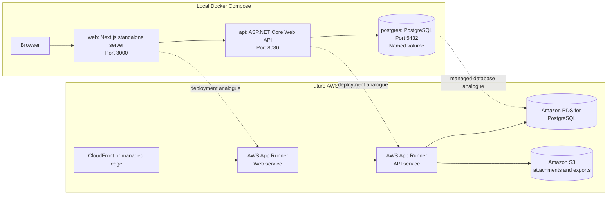
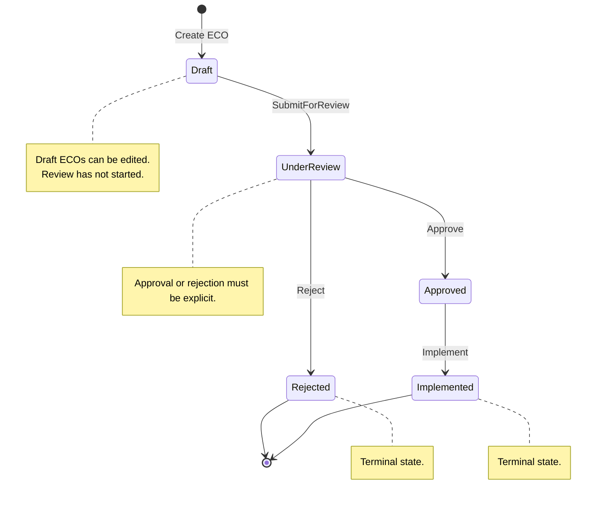

# EngiFlow


EngiFlow is a multi-tenant B2B SaaS platform for engineering teams that need a controlled, auditable process for Engineering Change Orders (ECOs). An ECO represents a formal request to change an engineering artifact, such as a material selection, CAD specification, manufacturing tolerance, or implementation procedure.

The platform is designed around strict tenant isolation, role-based access control, a domain-owned approval state machine, and an immutable audit trail. The current repository contains the foundational local orchestration, domain model, and EF Core PostgreSQL persistence layer.

## Project Overview

Engineering changes frequently affect cost, quality, compliance, safety, and production continuity. EngiFlow treats each ECO as a governed workflow rather than a generic task record. The domain model enforces the core lifecycle:

- ECOs are created as drafts.
- Drafts can be edited before review.
- Review is required before approval or rejection.
- Approved ECOs can be implemented.
- Rejected and implemented ECOs are terminal.
- Every material business action produces an audit event.

Multi-tenancy is a first-class architectural constraint. Company identity is modeled as the tenant boundary, and tenant-scoped entities carry a `CompanyId` so infrastructure can later enforce global query filters and data isolation.

## Architecture

EngiFlow uses a monorepo with a Next.js web application and an ASP.NET Core API organized with Clean Architecture and Domain-Driven Design.



### Backend Structure

The API is split into four projects:

- `EngiFlow.Domain`: entities, value objects, enums, domain exceptions, and domain contracts. This layer has no external dependencies.
- `EngiFlow.Application`: future use cases, DTOs, validation, and handlers.
- `EngiFlow.Infrastructure`: EF Core persistence, tenant query filters, audit interceptors, migrations, storage adapters, and integration implementations.
- `EngiFlow.Api`: ASP.NET Core composition root, HTTP endpoints, and dependency injection.

The current domain foundation is intentionally rich. The `EngineeringChangeOrder` aggregate owns its state transitions and creates `EcoEvent` audit records during business operations so callers cannot bypass the approval workflow or forget audit history. Infrastructure persists those pending audit events through a SaveChanges interceptor so application code does not need a second manual audit insert.



### Frontend Structure

The web application is a Next.js App Router project using TypeScript and Material UI. The Docker image uses Next.js standalone output so the runtime image contains only the traced production server, static assets, and public files needed to serve the app.

## Tech Stack

| Area | Technology |
| --- | --- |
| Frontend | Next.js 16, React 19, TypeScript, Material UI |
| Backend | ASP.NET Core Web API, .NET 10, C# |
| Domain | Clean Architecture, Domain-Driven Design, rich aggregates |
| Persistence | EF Core 10, Npgsql, PostgreSQL 18 |
| Orchestration | Docker Compose with a dedicated bridge network |
| Testing | xUnit for domain tests |
| Future Infrastructure | AWS App Runner, Amazon RDS for PostgreSQL, Amazon S3, Terraform |

## Getting Started

### Prerequisites

Install the following tools:

- Docker Desktop or Docker Engine with Compose support.
- .NET SDK 10 for local API builds and tests.
- Node.js 24 if running the web app outside Docker.

### Run the Full Local Stack

From the repository root:

```bash
docker compose up --build
```

This starts:

| Service | URL or Port | Purpose |
| --- | --- | --- |
| `web` | `http://localhost:3000` | Next.js frontend |
| `api` | `http://localhost:8080` | ASP.NET Core API |
| `postgres` | `localhost:5432` | Local PostgreSQL database |

PostgreSQL uses the named Docker volume `postgres-data`, so local database state survives container restarts and rebuilds.

The API reads `ConnectionStrings:DefaultConnection`. Docker Compose supplies the container connection string, while `api/src/EngiFlow.Api/appsettings.Development.json` points local `dotnet run` usage at `localhost:5432`.

### Development Tenant

Until authentication is added, Infrastructure uses a mock tenant provider. Configure the current tenant with:

```json
{
  "EngiFlow": {
    "Tenancy": {
      "CurrentCompanyId": "11111111-1111-1111-1111-111111111111"
    }
  }
}
```

If the key is missing, the same deterministic development tenant id is used. This keeps local migrations and smoke tests predictable while preserving the future JWT-backed tenant-provider boundary.

### Database Migrations

Restore the repo-local EF tool and list migrations:

```bash
DOTNET_CLI_HOME=/tmp dotnet tool restore
DOTNET_CLI_HOME=/tmp dotnet tool run dotnet-ef -- migrations list \
  --project api/src/EngiFlow.Infrastructure/EngiFlow.Infrastructure.csproj \
  --startup-project api/src/EngiFlow.Api/EngiFlow.Api.csproj \
  --context EngiFlowDbContext
```

Generate future migrations from the repository root:

```bash
DOTNET_CLI_HOME=/tmp dotnet tool run dotnet-ef -- migrations add MigrationName \
  --project api/src/EngiFlow.Infrastructure/EngiFlow.Infrastructure.csproj \
  --startup-project api/src/EngiFlow.Api/EngiFlow.Api.csproj \
  --context EngiFlowDbContext \
  --output-dir Persistence/Migrations
```

### Verify the Containers

Render and validate the Compose configuration:

```bash
docker compose config
```

Build the images without starting the stack:

```bash
docker compose build
```

Check running containers after startup:

```bash
docker compose ps
```

Stop the stack:

```bash
docker compose down
```

To remove the local PostgreSQL volume as well:

```bash
docker compose down -v
```

## Testing

Run the domain test suite from the repository root:

```bash
dotnet test api/tests/EngiFlow.Domain.Tests/EngiFlow.Domain.Tests.csproj
```

The current tests cover:

- Company tenant preservation.
- User validation and active-user invariants.
- ECO creation in draft status.
- Valid approval flow from draft to implemented.
- Invalid transitions such as approving directly from draft.
- Rejected and implemented terminal states.
- Audit event creation for ECO creation, edits, and transitions.
- Infrastructure tenant query filters.
- Tenant-scoped write validation.
- ECO audit-event persistence interception.
- Strongly typed identifier and enum conversion metadata.

Build the API solution:

```bash
DOTNET_CLI_HOME=/tmp dotnet build api/EngiFlow.slnx --no-restore /m:1
```

## Repository Layout

```text
.
+-- api/
|   +-- Dockerfile
|   +-- EngiFlow.slnx
|   +-- src/
|   |   +-- EngiFlow.Api/
|   |   +-- EngiFlow.Application/
|   |   +-- EngiFlow.Domain/
|   |   +-- EngiFlow.Infrastructure/
|   +-- tests/
|       +-- EngiFlow.Domain.Tests/
|       +-- EngiFlow.Infrastructure.Tests/
+-- web/
|   +-- Dockerfile
|   +-- app/
|   +-- next.config.ts
|   +-- package.json
+-- docker-compose.yml
```

## Current Scope

This foundation includes local orchestration, the core domain model, EF Core persistence, migrations, and domain/infrastructure tests. It intentionally does not yet include authentication, authorization policies, API controllers for ECOs, frontend workflows, file storage, or cloud deployment automation.

Those concerns should build on the current boundaries rather than bypass them:

- Persistence enforces `ITenantScoped` filters and strongly typed identifier conversions.
- API use cases should call aggregate methods instead of mutating status directly.
- Audit history should remain append-only.
- Tenant identity should be resolved centrally and applied consistently across queries and commands.
