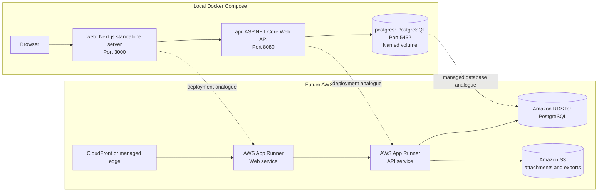
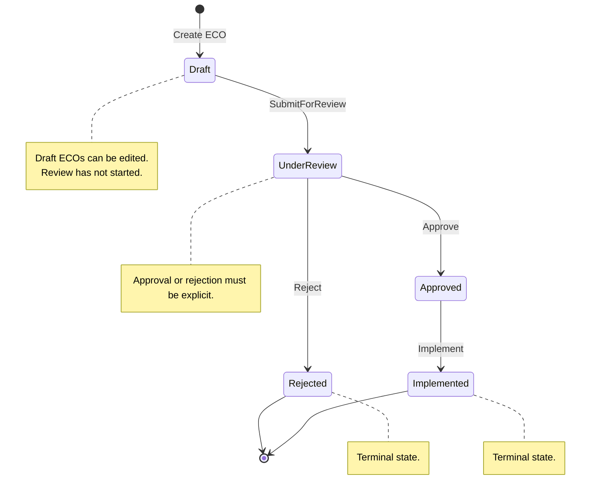

# EngiFlow


EngiFlow is a multi-tenant B2B SaaS platform for engineering teams that need a controlled, auditable process for Engineering Change Orders (ECOs). An ECO represents a formal request to change an engineering artifact, such as a material selection, CAD specification, manufacturing tolerance, or implementation procedure.

The platform is designed around strict tenant isolation, role-based access control, a domain-owned approval state machine, and an immutable audit trail. The current repository contains the foundational local orchestration, domain model, application use cases, and EF Core PostgreSQL persistence layer.

## Project Overview

Engineering changes frequently affect cost, quality, compliance, safety, and production continuity. EngiFlow treats each ECO as a governed workflow rather than a generic task record. The domain model enforces the core lifecycle:

- ECOs are created as drafts.
- Drafts can be edited before review.
- Review is required before approval or rejection.
- Approved ECOs can be implemented.
- Rejected and implemented ECOs are terminal.
- Every material business action produces an audit event.

Multi-tenancy is a first-class architectural constraint. Company identity is modeled as the tenant boundary, and tenant-scoped entities carry a `CompanyId` so infrastructure can later enforce global query filters and data isolation.

## Architecture

EngiFlow uses a monorepo with a Next.js web application and an ASP.NET Core API organized with Clean Architecture and Domain-Driven Design.



### Backend Structure

The API is split into four projects:

- `EngiFlow.Domain`: entities, value objects, enums, domain exceptions, and domain contracts. This layer has no external dependencies.
- `EngiFlow.Application`: CQRS use cases, DTOs, validation, application exceptions, tenant/user context contracts, persistence contracts, and handler orchestration.
- `EngiFlow.Infrastructure`: EF Core persistence, tenant query filters, audit interceptors, migrations, storage adapters, and integration implementations.
- `EngiFlow.Api`: ASP.NET Core composition root, HTTP endpoints, and dependency injection.

The current domain foundation is intentionally rich. The `EngineeringChangeOrder` aggregate owns its state transitions and creates `EcoEvent` audit records during business operations so callers cannot bypass the approval workflow or forget audit history. Infrastructure persists those pending audit events through a SaveChanges interceptor so application code does not need a second manual audit insert.

The Application layer exposes EngiFlow-owned CQRS primitives instead of depending on an external mediator package. Commands and queries implement `ICommand<TResponse>` or `IQuery<TResponse>`, handlers implement the matching handler contracts, and `IApplicationMediator` dispatches requests through ordered pipeline behaviors. `ValidationBehavior<TRequest, TResponse>` runs FluentValidation validators before handlers execute and throws the custom application `ValidationException` with errors grouped by request property.

Implemented ECO use cases:

- `CreateEcoCommand`: creates a draft ECO for the current tenant and current user.
- `SubmitEcoCommand`: transitions a draft ECO to under review.
- `ApproveEcoCommand`: transitions an ECO under review to approved.
- `RejectEcoCommand`: transitions an ECO under review to rejected with a required reason.
- `GetEcoByIdQuery`: retrieves one ECO with sorted audit history.
- `ListEcosQuery`: retrieves a tenant-scoped paginated list of ECO summaries.



### Frontend Structure

The web application is a Next.js App Router project using TypeScript and Material UI. The Docker image uses Next.js standalone output so the runtime image contains only the traced production server, static assets, and public files needed to serve the app.

## Tech Stack

| Area | Technology |
| --- | --- |
| Frontend | Next.js 16, React 19, TypeScript, Material UI |
| Backend | ASP.NET Core Web API, .NET 10, C# |
| Domain | Clean Architecture, Domain-Driven Design, rich aggregates |
| Application | Custom CQRS mediator, FluentValidation, DTO-based use cases |
| Persistence | EF Core 10, Npgsql, PostgreSQL 18 |
| Orchestration | Docker Compose with a dedicated bridge network |
| Testing | xUnit for domain tests |
| Future Infrastructure | AWS App Runner, Amazon RDS for PostgreSQL, Amazon S3, Terraform |

## Getting Started

### Prerequisites

Install the following tools:

- Docker Desktop or Docker Engine with Compose support.
- .NET SDK 10 for local API builds and tests.
- Node.js 24 if running the web app outside Docker.

### Run the Full Local Stack

From the repository root:

```bash
docker compose up --build
```

This starts:

| Service | URL or Port | Purpose |
| --- | --- | --- |
| `web` | `http://localhost:3000` | Next.js frontend |
| `api` | `http://localhost:8080` | ASP.NET Core API |
| `api` Swagger UI | `http://localhost:8080/swagger` | Interactive API documentation in Development |
| `postgres` | `localhost:5432` | Local PostgreSQL database |

PostgreSQL uses the named Docker volume `postgres-data`, so local database state survives container restarts and rebuilds.

The API reads `ConnectionStrings:DefaultConnection`. Docker Compose supplies the container connection string, while `api/src/EngiFlow.Api/appsettings.Development.json` points local `dotnet run` usage at `localhost:5432`.

### Development Tenant

Until authentication is added, Infrastructure uses a mock tenant provider. Configure the current tenant with:

```json
{
  "EngiFlow": {
    "Tenancy": {
      "CurrentCompanyId": "11111111-1111-1111-1111-111111111111",
      "CurrentUserId": "22222222-2222-2222-2222-222222222222"
    }
  }
}
```

If either key is missing, deterministic development identifiers are used. Commands validate that the configured current user exists and is active before mutating ECO state. This keeps local migrations and smoke tests predictable while preserving the future JWT-backed tenant-provider boundary.

### API Documentation and ECO Workflow

The API exposes Swagger UI in the `Development` environment. With Docker Compose, open:

```text
http://localhost:8080/swagger
```

When running the API directly, use the launch profile URL:

```bash
dotnet run --project api/src/EngiFlow.Api/EngiFlow.Api.csproj
```

Then open:

```text
http://localhost:5128/swagger
```

The OpenAPI document is available at `/swagger/v1/swagger.json`. Controller XML comments are included in the generated endpoint summaries, remarks, parameters, and response descriptions. Public ECO enum values are serialized as strings, such as `Medium`, `UnderReview`, and `Approved`.

The current ECO REST surface is:

| Method | Route | Purpose |
| --- | --- | --- |
| `POST` | `/api/ecos` | Create a draft ECO |
| `GET` | `/api/ecos/{id}` | Retrieve one ECO with audit history |
| `GET` | `/api/ecos?pageNumber=1&pageSize=20` | List paged ECO summaries |
| `PUT` | `/api/ecos/{id}/submit` | Submit a draft ECO for review |
| `PUT` | `/api/ecos/{id}/approve` | Approve an ECO under review |
| `PUT` | `/api/ecos/{id}/reject` | Reject an ECO under review |

Example flow:

```bash
curl -X POST http://localhost:8080/api/ecos \
  -H "Content-Type: application/json" \
  -d '{
    "title": "Use aluminum bracket",
    "description": "Update load-bearing bracket material from steel to aluminum.",
    "priority": "Medium"
  }'

curl "http://localhost:8080/api/ecos?pageNumber=1&pageSize=20"

curl http://localhost:8080/api/ecos/<eco-id>

curl -X PUT http://localhost:8080/api/ecos/<eco-id>/submit

curl -X PUT http://localhost:8080/api/ecos/<eco-id>/approve

curl -X PUT http://localhost:8080/api/ecos/<eco-id>/reject \
  -H "Content-Type: application/json" \
  -d '{ "reason": "Specification is incomplete." }'
```

Until authentication and onboarding are implemented, ECO write commands use the configured development tenant and user. The configured current user must already exist and be active in the database, otherwise write commands return `404 Not Found`.

### API Error Handling

The API uses a global ASP.NET Core exception handler that returns RFC 7807 `ProblemDetails` responses and does not expose stack traces to clients.

| Exception or failure | Status | Response shape |
| --- | --- | --- |
| Application `ValidationException` | `400 Bad Request` | `ValidationProblemDetails` with `errors` grouped by field |
| `EntityNotFoundException` | `404 Not Found` | `ProblemDetails` with the missing resource detail |
| Domain `DomainException` | `409 Conflict` | `ProblemDetails` with the violated business rule |
| Unhandled exception | `500 Internal Server Error` | Generic `ProblemDetails`; full details are logged server-side |

Validation responses are designed for frontend form rendering:

```json
{
  "type": "https://tools.ietf.org/html/rfc9110#section-15.5.1",
  "title": "Validation failed.",
  "status": 400,
  "detail": "One or more request values failed validation.",
  "instance": "/api/ecos",
  "errors": {
    "Title": ["Title is required."]
  },
  "traceId": "0H..."
}
```

### Database Migrations

Restore the repo-local EF tool and list migrations:

```bash
dotnet tool restore
dotnet tool run dotnet-ef -- migrations list \
  --project api/src/EngiFlow.Infrastructure/EngiFlow.Infrastructure.csproj \
  --startup-project api/src/EngiFlow.Api/EngiFlow.Api.csproj \
  --context EngiFlowDbContext
```

Generate future migrations from the repository root:

```bash
dotnet tool run dotnet-ef -- migrations add MigrationName \
  --project api/src/EngiFlow.Infrastructure/EngiFlow.Infrastructure.csproj \
  --startup-project api/src/EngiFlow.Api/EngiFlow.Api.csproj \
  --context EngiFlowDbContext \
  --output-dir Persistence/Migrations
```

### Verify the Containers

Render and validate the Compose configuration:

```bash
docker compose config
```

Build the images without starting the stack:

```bash
docker compose build
```

Check running containers after startup:

```bash
docker compose ps
```

Stop the stack:

```bash
docker compose down
```

To remove the local PostgreSQL volume as well:

```bash
docker compose down -v
```

## Testing

Run the domain test suite from the repository root:

```bash
dotnet test api/tests/EngiFlow.Domain.Tests/EngiFlow.Domain.Tests.csproj
```

The current tests cover:

- Company tenant preservation.
- User validation and active-user invariants.
- ECO creation in draft status.
- Valid approval flow from draft to implemented.
- Invalid transitions such as approving directly from draft.
- Rejected and implemented terminal states.
- Audit event creation for ECO creation, edits, and transitions.
- Application CQRS validation behavior.
- ECO command handlers for create, submit, approve, and reject.
- ECO query handlers for detail retrieval and paginated lists.
- Infrastructure tenant query filters.
- Tenant-scoped write validation.
- ECO audit-event persistence interception.
- Strongly typed identifier and enum conversion metadata.

Run the full API solution test suite:

```bash
dotnet test api/EngiFlow.slnx /m:1
```

Build the API solution:

```bash
dotnet build api/EngiFlow.slnx --no-restore /m:1
```

## Repository Layout

```text
.
+-- api/
|   +-- Dockerfile
|   +-- EngiFlow.slnx
|   +-- src/
|   |   +-- EngiFlow.Api/
|   |   +-- EngiFlow.Application/
|   |   +-- EngiFlow.Domain/
|   |   +-- EngiFlow.Infrastructure/
|   +-- tests/
|       +-- EngiFlow.Application.Tests/
|       +-- EngiFlow.Domain.Tests/
|       +-- EngiFlow.Infrastructure.Tests/
+-- web/
|   +-- Dockerfile
|   +-- app/
|   +-- next.config.ts
|   +-- package.json
+-- docker-compose.yml
```

## Current Scope

This foundation includes local orchestration, the core domain model, Application-layer CQRS use cases, validation, EF Core persistence, migrations, and application/domain/infrastructure tests. It intentionally does not yet include authentication, authorization policies, API controllers for ECOs, frontend workflows, file storage, or cloud deployment automation.

Those concerns should build on the current boundaries rather than bypass them:

- Persistence enforces `ITenantScoped` filters and strongly typed identifier conversions.
- API endpoints should dispatch Application commands and queries through `IApplicationMediator`.
- Application command handlers should call aggregate methods instead of mutating status directly.
- Audit history should remain append-only.
- Tenant identity should be resolved centrally and applied consistently across queries and commands.
