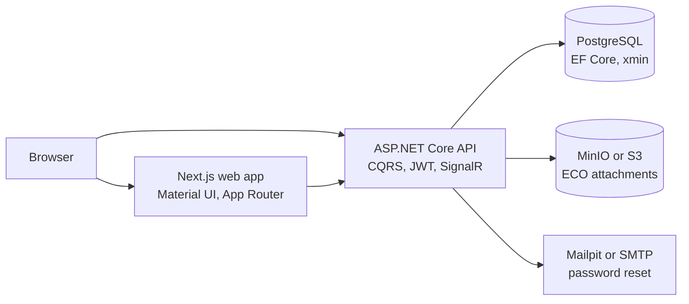
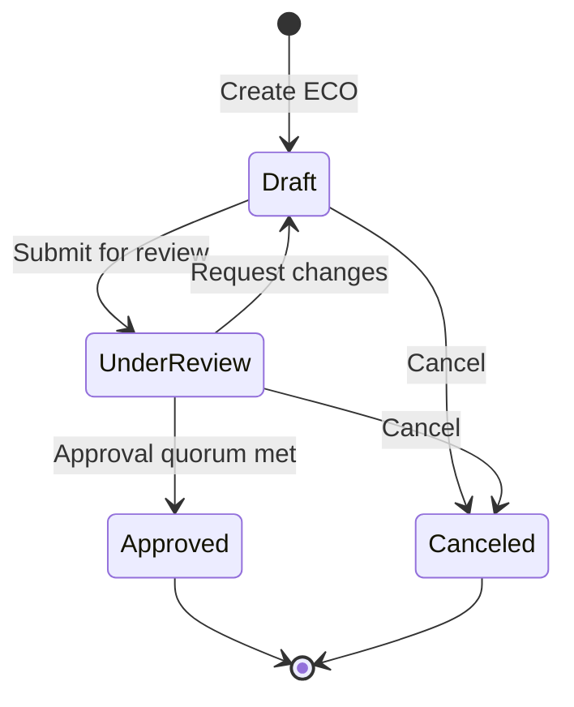

# EngiFlow

EngiFlow is a production-oriented B2B SaaS platform for controlled Product Lifecycle Management workflows. It gives engineering, manufacturing, quality, and operations teams a governed Engineering Change Order (ECO) process with tenant isolation, role-based access control, real-time collaboration, approval quorum policy, S3-compatible file storage, and an immutable audit trail.

The current branch, `feat/eco-pr-workflow-and-realtime`, completes the MVP governance layer: ISO 9001 segregation of duties, tenant workflow policies, administrator team management, last-login visibility, and real-time security enforcement.

## Business Value

Engineering changes affect released designs, supplier requirements, manufacturing instructions, quality records, cost, schedule, and customer commitments. EngiFlow treats an ECO as a controlled business record instead of a generic task:

- Requesters create and revise ECO drafts.
- Authorized reviewers make formal approval decisions.
- Tenant policy determines the approval quorum.
- The author of an ECO cannot approve their own change.
- Every material workflow action creates an audit event.
- Attachments are stored in S3-compatible object storage with database metadata.
- Administrators can change roles or deactivate users, and affected sessions are updated immediately over SignalR.

The result is an enterprise-ready foundation for PLM workflows where compliance controls are enforced in the backend domain and reflected immediately in the frontend.

## Architecture

EngiFlow is a monorepo with a .NET 10 API and a Next.js 16 web application.



Browser HTTP calls normally use the Next.js `/api/...` proxy unless a public API URL is configured. SignalR connections intentionally connect directly to the ASP.NET Core API at `/hubs/ecos` and `/hubs/security` so WebSocket traffic bypasses the Next.js proxy.

## Technology Stack

| Area | Technology |
| --- | --- |
| Frontend | Next.js 16, React 19, TypeScript, Material UI, MUI X DataGrid, MUI X Date Pickers |
| Backend | .NET 10, ASP.NET Core Web API, SignalR, JWT bearer authentication |
| Application | MediatR-backed CQRS, FluentValidation, post-commit notifications |
| Domain | Clean Architecture, DDD aggregate roots, strongly typed IDs |
| Persistence | EF Core 10, Npgsql, PostgreSQL 18, `xmin` optimistic concurrency |
| Storage | S3-compatible attachment storage, MinIO for local development |
| Email | MailKit SMTP, Mailpit for local password reset mail |
| Orchestration | Docker Compose |
| Tests | xUnit for API, application, domain, and infrastructure projects |

## Repository Layout

```text
.
+-- api/
|   +-- src/
|   |   +-- EngiFlow.Api/
|   |   +-- EngiFlow.Application/
|   |   +-- EngiFlow.Domain/
|   |   +-- EngiFlow.Infrastructure/
|   +-- tests/
|       +-- EngiFlow.Api.Tests/
|       +-- EngiFlow.Application.Tests/
|       +-- EngiFlow.Domain.Tests/
|       +-- EngiFlow.Infrastructure.Tests/
+-- web/
|   +-- app/
|   +-- components/
|   +-- lib/
+-- docker-compose.yml
```

## Governance Model

### ECO State Machine



Important workflow rules:

- Draft ECOs can be edited, commented on, and have affected items or attachments added.
- Submitting an ECO starts a new review round.
- Only decisions from the active review round count toward quorum.
- `RequestChanges` returns the ECO to draft and requires a new review round.
- Approved and canceled ECOs are terminal for the MVP workflow.
- The domain aggregate creates audit events as part of state transitions.

### ISO 9001 Segregation of Duties

EngiFlow enforces a hard segregation-of-duties rule:

```text
Compliance Rule: The author of the ECO cannot participate in its approval quorum
```

The rule is enforced in the ECO decision path and in the aggregate itself, so compatibility routes and future callers cannot bypass it. This implements the core quality-system principle that the person requesting or authoring a controlled change cannot be the person approving that same change into effect.

### Tenant Workflow Policy

Tenant owners and administrators manage workflow settings through:

| Method | Route | Purpose |
| --- | --- | --- |
| `GET` | `/api/settings` | Read tenant workflow settings |
| `PUT` | `/api/settings` | Update `minApprovalsRequired` |

`MinApprovalsRequired` must be at least `1`. If an older tenant lacks a settings row, EngiFlow creates default settings on first read or update.

The frontend warns administrators when the configured quorum is higher than the count of active users whose exact role is `Approver`:

```text
Warning: You require X approvals, but only have Y Approvers active. ECOs may become stuck.
```

Owner and Administrator users can approve by authorization policy, but the warning intentionally follows the MVP requirement and counts only active `Approver` role users.

## RBAC Matrix

| Capability | Owner | Administrator | Approver | Requester | Viewer |
| --- | --- | --- | --- | --- | --- |
| Read ECOs | Yes | Yes | Yes | Yes | Yes |
| Comment on ECOs | Yes | Yes | Yes | Yes | Yes |
| Create ECOs | Yes | Yes | No | Yes | No |
| Edit draft ECOs | Yes | Yes | No | Yes | No |
| Submit ECOs for review | Yes | Yes | No | Yes | No |
| Approve or request changes | Yes | Yes | Yes | No | No |
| Manage users | Yes | Yes | No | No | No |
| Manage workflow policy | Yes | Yes | No | No | No |

Additional immutable rules:

- `Owner` inherits Administrator privileges.
- Owner users cannot be modified or deactivated.
- No endpoint can create or promote a user to Owner.
- Users cannot change their own role.
- Users cannot deactivate themselves.
- Deactivated users cannot authenticate or act in the domain.

## Real-Time Behavior

EngiFlow uses two authenticated SignalR hubs:

| Hub | Purpose |
| --- | --- |
| `/hubs/ecos` | Tenant-scoped ECO timeline/status updates after committed commands |
| `/hubs/security` | Targeted current-user role/deactivation enforcement |

ECO events are broadcast to the tenant group. Security events are targeted to the affected SignalR user ID, which is derived from the JWT `sub` claim.

Security events:

- `UserPermissionsChanged(userId, newRole)`: the current browser session updates its stored role immediately.
- `UserDeactivated(userId)`: the current browser session clears auth storage and hard redirects to `/login`.

The API also refreshes the role from the database during JWT validation and rejects inactive users. This prevents stale JWT role claims from retaining old privileges after an administrative change.

## Local Development

### Prerequisites

- Docker Desktop or Docker Engine with Compose.
- .NET SDK 10 for local backend work.
- Node.js 24 for local frontend work.

### Run the Full Stack

From the repository root:

```bash
docker compose up --build
```

Services:

| Service | URL or Port | Purpose |
| --- | --- | --- |
| `web` | `http://localhost:3000` | Next.js frontend |
| `api` | `http://localhost:8080` | ASP.NET Core API |
| Swagger | `http://localhost:8080/swagger` | API explorer in Development |
| `postgres` | `localhost:5432` | PostgreSQL database |
| `minio` | `http://localhost:9001` | S3-compatible object storage console |
| `mailpit` | `http://localhost:8025` | Local SMTP inbox |

Named volumes preserve local database and MinIO object state:

- `postgres-data`
- `minio-data`

Stop the stack:

```bash
docker compose down
```

Remove volumes too:

```bash
docker compose down -v
```

### Default Development Login

When the API runs in `Development`, it applies migrations and seeds a tenant if no companies exist.

| Field | Value |
| --- | --- |
| Company | `EngiFlow Demo Company` |
| Email | `admin@engiflow.local` |
| Password | `EngiFlow_Admin_123!` |
| Role | `Owner` |

Open:

```text
http://localhost:3000/login
```

New tenants can self-register at:

```text
http://localhost:3000/register
```

## Configuration

Docker Compose supplies local defaults for PostgreSQL, MinIO, and Mailpit. Production deployments must override at least JWT signing settings and external service credentials.

JWT configuration:

```json
{
  "EngiFlow": {
    "Authentication": {
      "Jwt": {
        "Issuer": "EngiFlow.Api",
        "Audience": "EngiFlow.Clients",
        "SigningKey": "replace-with-at-least-32-characters",
        "AccessTokenMinutes": 60
      }
    }
  }
}
```

S3-compatible storage:

```json
{
  "EngiFlow": {
    "Storage": {
      "S3": {
        "BucketName": "engiflow-attachments",
        "Region": "us-east-1",
        "ServiceUrl": "http://localhost:9000",
        "AccessKey": "minioadmin",
        "SecretKey": "minioadmin",
        "ForcePathStyle": true
      }
    }
  }
}
```

Frontend API configuration:

| Variable | Purpose |
| --- | --- |
| `API_INTERNAL_BASE_URL` | Server-side Next.js proxy target, defaulting to `http://api:8080` in Docker |
| `NEXT_PUBLIC_API_URL` | Browser-visible API base URL |
| `NEXT_PUBLIC_API_BASE_URL` | Browser-visible API base URL fallback |

If no public API base URL is set, SignalR uses `http://localhost:8080` for direct browser connections.

## API Surface

| Method | Route | Purpose |
| --- | --- | --- |
| `POST` | `/api/auth/login` | Authenticate, update `LastLoginAt`, issue JWT |
| `POST` | `/api/auth/register-company` | Create tenant, first Owner, default settings, JWT |
| `POST` | `/api/auth/forgot-password` | Send password reset mail through SMTP |
| `GET` | `/api/settings` | Read tenant workflow settings |
| `PUT` | `/api/settings` | Update tenant workflow settings |
| `GET` | `/api/users` | List active tenant users with `lastLoginAt` |
| `POST` | `/api/users` | Create Administrator, Approver, Requester, or Viewer |
| `PUT` | `/api/users/{id}/role` | Change a mutable user's role |
| `PUT` | `/api/users/{id}/deactivate` | Soft-deactivate a mutable user |
| `POST` | `/api/ecos` | Create a draft ECO |
| `GET` | `/api/ecos` | List paged ECO summaries |
| `GET` | `/api/ecos/{id}` | Read an ECO with timeline details |
| `PUT` | `/api/ecos/{id}/details` | Update draft ECO details |
| `POST` | `/api/ecos/{id}/affected-items` | Add an affected item |
| `DELETE` | `/api/ecos/{id}/affected-items/{itemId}` | Remove an affected item |
| `POST` | `/api/ecos/{id}/comments` | Add a timeline comment |
| `POST` | `/api/ecos/{id}/attachments` | Upload attachment metadata and S3 object |
| `PUT` | `/api/ecos/{id}/submit` | Submit draft ECO for review |
| `POST` | `/api/ecos/{id}/review-decisions` | Submit `Approve` or `RequestChanges` |
| `PUT` | `/api/ecos/{id}/cancel` | Cancel a draft or under-review ECO |
| `PUT` | `/api/ecos/{id}/approve` | Compatibility approval route |
| `PUT` | `/api/ecos/{id}/reject` | Compatibility request-changes route |

## Verification

Backend:

```bash
dotnet test api/EngiFlow.slnx /m:1
```

Frontend:

```bash
cd web
npm run lint
npm run build
```

Useful Docker checks:

```bash
docker compose config
docker compose build
docker compose ps
```

## Current MVP Scope

Implemented:

- Tenant registration and seeded development tenant.
- JWT authentication with dynamic role refresh.
- Owner/Administrator user management.
- Last-login tracking.
- User role and deactivation enforcement over SignalR.
- Tenant workflow policy management.
- ISO 9001 ECO author/approver segregation of duties.
- PR-like ECO detail workflow.
- MUI X DataGrid dashboards and team management.
- S3/MinIO ECO attachments with compensation.
- PostgreSQL persistence with tenant query filters and `xmin` concurrency.
- Root, API, application, domain, infrastructure, and frontend verification paths.

Not included yet:

- Refresh tokens.
- Production invitation workflow.
- Advanced notification preferences.
- Deployment infrastructure as code.
- Full PLM part/BOM/revision master data.
