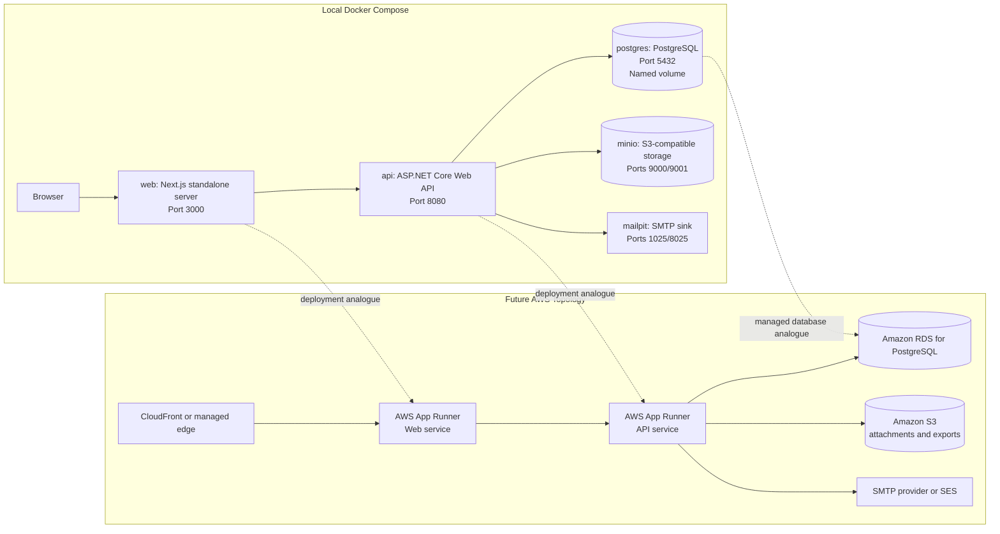
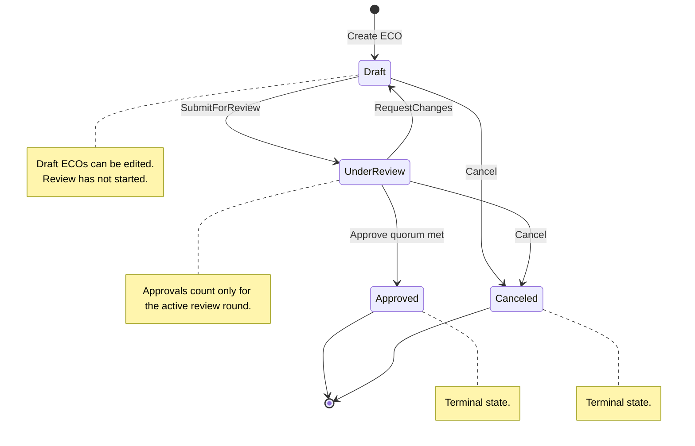

# EngiFlow


EngiFlow is a multi-tenant B2B SaaS platform for engineering teams that need a controlled, auditable process for Engineering Change Orders (ECOs). An ECO represents a formal request to change an engineering artifact, such as a material selection, CAD specification, manufacturing tolerance, or implementation procedure.

The platform is designed around strict tenant isolation, JWT-backed role-based access control, a domain-owned approval state machine, optimistic concurrency, S3-compatible attachment storage, real-time tenant updates, and an immutable audit trail. The current repository contains the foundational local orchestration, domain model, application use cases, EF Core PostgreSQL persistence layer, secured ASP.NET Core API surface, and self-service company onboarding.

## Project Overview

Engineering changes frequently affect cost, quality, compliance, safety, and production continuity. EngiFlow treats each ECO as a governed workflow rather than a generic task record. The domain model enforces the core lifecycle:

- ECOs are created as drafts.
- Drafts can be edited before review.
- Review is required before approval.
- Approvers can request changes, which returns the ECO to draft and starts a new review round on resubmission.
- Tenant quorum settings determine how many current-round approvals are required.
- Approved and canceled ECOs are terminal in the active workflow.
- Every material business action produces an audit event.

Multi-tenancy is a first-class architectural constraint. Company identity is modeled as the tenant boundary, and tenant-scoped entities carry a `CompanyId` so infrastructure can enforce global query filters and data isolation from the tenant claim in the authenticated JWT.

## Architecture

EngiFlow uses a monorepo with a Next.js web application and an ASP.NET Core API organized with Clean Architecture and Domain-Driven Design.



### Backend Structure

The API is split into four projects:

- `EngiFlow.Domain`: entities, value objects, enums, domain exceptions, and domain contracts. This layer has no external dependencies.
- `EngiFlow.Application`: CQRS use cases, DTOs, validation, application exceptions, tenant/user context contracts, persistence contracts, and handler orchestration.
- `EngiFlow.Infrastructure`: EF Core persistence, tenant query filters, audit interceptors, migrations, password hashing, storage adapters, and integration implementations.
- `EngiFlow.Api`: ASP.NET Core composition root, JWT authentication, RBAC policies, HTTP tenant resolution, controllers, Swagger, and dependency injection.

The current domain foundation is intentionally rich. The `EngineeringChangeOrder` aggregate owns its state transitions and creates `EcoEvent` audit records during business operations so callers cannot bypass the approval workflow or forget audit history. Infrastructure persists those pending audit events through a SaveChanges interceptor so application code does not need a second manual audit insert.

The Application layer exposes EngiFlow-owned CQRS primitives on top of MediatR. Commands and queries implement `ICommand<TResponse>` or `IQuery<TResponse>`, which adapt to `IRequest<TResponse>` while controllers continue to dispatch through `IApplicationMediator`. `ValidationBehavior<TRequest, TResponse>` runs FluentValidation validators before handlers execute. Infrastructure registers `TransactionBehavior<TRequest, TResponse>`, which wraps commands, not queries, in an EF Core transaction, commits on success, rolls back on exceptions, and executes registered external compensations such as S3 object deletion.

Implemented application use cases:

- `LoginQuery`: validates email/password credentials and returns an enriched authenticated session with a JWT bearer token, user name, company name, and roles.
- `RegisterCompanyCommand`: creates a new company tenant, first Owner, default company settings, password hash, and immediate enriched authenticated session.
- `ForgotPasswordCommand`: accepts a reset request and sends the reset link through SMTP.
- `ListUsersQuery`: lists active users in the current tenant for Owners and Administrators.
- `CreateUserCommand`: creates an active Administrator, Approver, Requester, or Viewer in the current tenant.
- `UpdateUserRoleCommand` and `DeactivateUserCommand`: enforce Owner immutability, self-role-change protection, and soft-delete deactivation.
- `CreateEcoCommand`: creates a draft ECO for the current tenant and current user.
- `UpdateEcoDetailsCommand`, `AddAffectedItemCommand`, `RemoveAffectedItemCommand`, `AddCommentCommand`, and `UploadAttachmentCommand`: manage draft ECO content, timeline comments, engineering diff rows, and S3 attachment metadata.
- `SubmitEcoCommand`: transitions a draft ECO to under review.
- `SubmitReviewDecisionCommand`: records Approve or RequestChanges decisions and applies tenant quorum rules.
- `ApproveEcoCommand` and `RejectEcoCommand`: compatibility wrappers over the review-decision workflow.
- `CancelEcoCommand`: transitions nonterminal ECOs to canceled.
- `GetEcoByIdQuery`: retrieves one ECO with sorted audit history.
- `ListEcosQuery`: retrieves a tenant-scoped paginated list of ECO summaries.



### Frontend Structure

The web application is a Next.js App Router project using TypeScript and Material UI. The Docker image uses Next.js standalone output so the runtime image contains only the traced production server, static assets, and public files needed to serve the app.

The current frontend foundation includes:

- Material UI App Router SSR wiring through `AppRouterCacheProvider` from `@mui/material-nextjs/v16-appRouter`.
- A baseline Material Design 2 theme with a restrained B2B SaaS palette and Roboto loaded globally through `@fontsource/roboto`.
- Protected workspace routes grouped under `web/app/(authenticated)`, with `/login` kept outside the authenticated shell.
- A responsive Material UI application shell with a clean fixed AppBar, mobile hamburger menu, desktop permanent Drawer, mobile temporary Drawer, route-aware page title, company name display, drawer branding, and bottom-anchored user profile/logout controls.
- Role-aware shell navigation for Dashboard (`/`), ECOs (`/ecos`), and administrator-visible Team Management (`/settings/users`) using Material SVG icons from `@mui/icons-material`.
- A responsive split-screen Material UI login page at `/login` that posts credentials through the shared API client, supports "Remember me", opens a forgot-password dialog, stores the enriched auth session through `AuthContext`, and redirects authenticated users to the workspace root.
- A responsive public company registration wizard at `/register` using Material UI `Stepper`, client-side step validation, backend validation feedback, automatic token storage, and immediate redirect into the workspace.
- Client-side route protection for all authenticated workspace routes, redirecting unauthenticated users to `/login`.
- A protected metrics dashboard placeholder at `/`, an ECO dashboard at `/ecos` that lists paged ECO summaries with dense Material UI table styling, reusable status and priority chips, loading skeleton rows, horizontal mobile overflow, linked detail navigation, and an empty state, plus a Team Management dashboard at `/settings/users` for administrator user listing and Requester/Approver creation.
- Core ECO frontend workflow routes: `/ecos/new` creates draft ECOs through the shared API client, and `/ecos/[id]` displays read-only ECO details, role-aware submit/approve/reject actions, a rejection reason dialog, a Material UI lifecycle stepper, and the audit trail returned by the API.
- Reusable atomic UI components under `web/components/ui`, including `PageHeader`, `StatusChip`, `PriorityChip`, and the Next.js link adapter used by Material UI navigation controls.
- A typed native `fetch` API client that reads optional public API base URLs and otherwise uses same-origin `/api/...` requests through the Next.js proxy.
- A React authentication context that decodes backend JWT claims (`sub`, `tenant`, `role`, `user_name`, `company_name`, optional `exp`), stores remembered sessions in local storage, stores non-remembered sessions in session storage, mirrors the bearer token to a non-HttpOnly cookie for the proxy, and clears auth state on `401 Unauthorized`.

## Tech Stack

| Area | Technology |
| --- | --- |
| Frontend | Next.js 16, React 19, TypeScript, Material UI |
| Backend | ASP.NET Core Web API, SignalR, JWT bearer authentication, .NET 10, C# |
| Domain | Clean Architecture, Domain-Driven Design, rich aggregates |
| Application | MediatR-backed CQRS, FluentValidation, transactional pipeline behaviors, DTO-based use cases |
| Persistence | EF Core 10, Npgsql, PostgreSQL 18, xmin optimistic concurrency |
| Integrations | AWSSDK.S3 for S3/MinIO attachments, MailKit SMTP for password reset email |
| Orchestration | Docker Compose with PostgreSQL, MinIO, Mailpit, and a dedicated bridge network |
| Testing | xUnit for API, application, domain, and infrastructure tests |
| Future Infrastructure | AWS App Runner, Amazon RDS for PostgreSQL, Amazon S3, Terraform |

## Getting Started

### Prerequisites

Install the following tools:

- Docker Desktop or Docker Engine with Compose support.
- .NET SDK 10 for local API builds and tests.
- Node.js 24 if running the web app outside Docker.

### Run the Full Local Stack

From the repository root:

```bash
docker compose up --build
```

This starts:

| Service | URL or Port | Purpose |
| --- | --- | --- |
| `web` | `http://localhost:3000` | Next.js frontend |
| `api` | `http://localhost:8080` | ASP.NET Core API |
| `api` Swagger UI | `http://localhost:8080/swagger` | Interactive API documentation in Development |
| `postgres` | `localhost:5432` | Local PostgreSQL database |
| `minio` | `http://localhost:9001` | Local S3-compatible attachment store console |
| `mailpit` | `http://localhost:8025` | Local password-reset email inbox |

PostgreSQL uses the named Docker volume `postgres-data`, and MinIO uses `minio-data`, so local database and object state survive container restarts and rebuilds. The attachment bucket defaults to `engiflow-attachments`.

### Frontend Configuration

The web app calls the API through the typed client in `web/lib/api/client.ts`. By default, browser requests use same-origin `/api/...` URLs, and the Next.js route handler in `web/app/api/[...path]/route.ts` proxies those requests to the ASP.NET Core API. Docker Compose sets the server-side proxy target to:

```bash
API_INTERNAL_BASE_URL=http://api:8080
```

For non-Docker local development, the proxy falls back to `http://localhost:8080`. If you need the browser to call an externally reachable API directly, set `NEXT_PUBLIC_API_URL` or `NEXT_PUBLIC_API_BASE_URL`; otherwise leave them unset so the same-origin proxy avoids CORS and forwarded-port issues. Authenticated requests automatically include:

```text
Authorization: Bearer <accessToken>
```

When the API returns `401 Unauthorized`, the frontend clears the stored session, emits an auth-state event, and redirects browser clients to `/login`. The login page submits credentials to `POST /api/auth/login`, stores the returned auth session through the authentication context, and redirects successful sign-ins to `/`. If "Remember me" is enabled the session is stored in `localStorage`; otherwise it is stored in `sessionStorage`. The login page also submits forgot-password requests to `POST /api/auth/forgot-password`; in local Docker those messages are visible in Mailpit at `http://localhost:8025`. New companies can use `/register`, which submits to `POST /api/auth/register-company`, stores the returned auth session as remembered, and redirects the new Owner to `/`. Existing frontend ECO screens still use the compatibility approve/reject routes; the backend now also exposes the PR-like review-decision, comment, affected-item, attachment, and cancel routes listed below.

The API reads `ConnectionStrings:DefaultConnection`. Docker Compose supplies the container connection string, while `api/src/EngiFlow.Api/appsettings.Development.json` points local `dotnet run` usage at `localhost:5432`.

### Security and Default Login

In `Development`, the API applies EF Core migrations at startup and seeds a default company plus Owner when the database has no companies. The seeded credentials are for local development only:

| Field | Value |
| --- | --- |
| Company | `EngiFlow Demo Company` |
| Email | `admin@engiflow.local` |
| Password | `EngiFlow_Admin_123!` |
| Role | `Owner` |

Authenticate with:

```text
http://localhost:3000/login
```

New companies can self-register with:

```text
http://localhost:3000/register
```

The first user is the tenant `Owner`. Their password must be at least 12 characters and include uppercase, lowercase, numeric, and symbol characters.

Or call the API directly:

```bash
curl -X POST http://localhost:8080/api/auth/login \
  -H "Content-Type: application/json" \
  -d '{
    "email": "admin@engiflow.local",
    "password": "EngiFlow_Admin_123!"
  }'
```

The auth response contains `accessToken`, `tokenType`, `expiresAtUtc`, `userName`, `companyName`, and `roles`. Send the token to secured endpoints as:

```text
Authorization: Bearer <accessToken>
```

JWT settings are read from `EngiFlow:Authentication:Jwt`:

```json
{
  "EngiFlow": {
    "Authentication": {
      "Jwt": {
        "Issuer": "EngiFlow.Api",
        "Audience": "EngiFlow.Clients",
        "SigningKey": "replace-with-at-least-32-characters",
        "AccessTokenMinutes": 60
      }
    }
  }
}
```

`appsettings.Development.json` includes a development signing key. Production deployments must override `SigningKey`, `Issuer`, and `Audience` through environment-specific configuration or secret management.

Attachment storage and password-reset email use these configuration sections:

```json
{
  "EngiFlow": {
    "Storage": {
      "S3": {
        "BucketName": "engiflow-attachments",
        "Region": "us-east-1",
        "ServiceUrl": "http://localhost:9000",
        "AccessKey": "minioadmin",
        "SecretKey": "minioadmin",
        "ForcePathStyle": true
      }
    },
    "Email": {
      "Smtp": {
        "Host": "localhost",
        "Port": 1025,
        "UseStartTls": false,
        "FromEmail": "no-reply@engiflow.local",
        "FromName": "EngiFlow"
      }
    }
  }
}
```

### API Documentation and ECO Workflow

The API exposes Swagger UI in the `Development` environment. With Docker Compose, open:

```text
http://localhost:8080/swagger
```

When running the API directly, use the launch profile URL:

```bash
dotnet run --project api/src/EngiFlow.Api/EngiFlow.Api.csproj
```

Then open:

```text
http://localhost:5128/swagger
```

The OpenAPI document is available at `/swagger/v1/swagger.json`. Controller XML comments are included in the generated endpoint summaries, remarks, parameters, and response descriptions. Public ECO enum values are serialized as strings, such as `Medium`, `UnderReview`, and `Approved`.

Swagger UI supports JWT bearer authentication. Call `POST /api/auth/login`, copy the `accessToken`, click `Authorize`, and enter:

```text
Bearer <accessToken>
```

The current REST surface is:

| Method | Route | Purpose |
| --- | --- | --- |
| `POST` | `/api/auth/login` | Authenticate and issue a JWT bearer token |
| `POST` | `/api/auth/register-company` | Create a company tenant, first Owner, default settings, and JWT bearer token |
| `POST` | `/api/auth/forgot-password` | Accept a forgot-password request and send an SMTP reset email |
| `GET` | `/api/users` | List active users in the current tenant; requires Owner or Administrator |
| `POST` | `/api/users` | Create an Administrator, Approver, Requester, or Viewer; requires Owner or Administrator |
| `PATCH` | `/api/users/{id}/role` | Change a user's role while enforcing Owner immutability and self-role-change protections |
| `DELETE` | `/api/users/{id}` | Soft-delete a user by deactivating them |
| `POST` | `/api/ecos` | Create a draft ECO |
| `GET` | `/api/ecos/{id}` | Retrieve one ECO with audit history |
| `GET` | `/api/ecos?pageNumber=1&pageSize=20` | List paged ECO summaries |
| `PUT` | `/api/ecos/{id}/details` | Update draft ECO title, description, and priority |
| `POST` | `/api/ecos/{id}/affected-items` | Add a draft ECO affected-item diff row |
| `DELETE` | `/api/ecos/{id}/affected-items/{itemId}` | Remove a draft ECO affected-item diff row |
| `POST` | `/api/ecos/{id}/comments` | Add a timeline comment to a non-canceled ECO |
| `POST` | `/api/ecos/{id}/attachments` | Upload a validated multipart attachment to S3/MinIO and record metadata |
| `PUT` | `/api/ecos/{id}/submit` | Submit a draft ECO for review |
| `POST` | `/api/ecos/{id}/review-decisions` | Submit `Approve` or `RequestChanges` for the active review round |
| `PUT` | `/api/ecos/{id}/cancel` | Cancel a draft or under-review ECO |
| `PUT` | `/api/ecos/{id}/approve` | Compatibility approval route |
| `PUT` | `/api/ecos/{id}/reject` | Compatibility request-changes route |
| SignalR | `/hubs/ecos` | Authenticated tenant group for committed ECO timeline/status updates |

Example flow:

```bash
curl -X POST http://localhost:8080/api/auth/register-company \
  -H "Content-Type: application/json" \
  -d '{
    "companyName": "Acme Engineering",
    "adminName": "Ada Lovelace",
    "adminEmail": "ada@acme.example",
    "adminPassword": "StrongPass123!"
  }'

curl -X POST http://localhost:8080/api/auth/login \
  -H "Content-Type: application/json" \
  -d '{
    "email": "admin@engiflow.local",
    "password": "EngiFlow_Admin_123!"
  }'

TOKEN="<accessToken from the login response>"

curl -X POST http://localhost:8080/api/auth/forgot-password \
  -H "Content-Type: application/json" \
  -d '{ "email": "admin@engiflow.local" }'

curl http://localhost:8080/api/users \
  -H "Authorization: Bearer $TOKEN"

curl -X POST http://localhost:8080/api/users \
  -H "Authorization: Bearer $TOKEN" \
  -H "Content-Type: application/json" \
  -d '{
    "name": "Grace Hopper",
    "email": "grace@acme.example",
    "password": "StrongPass123!",
    "role": "Approver"
  }'

curl -X PATCH http://localhost:8080/api/users/<user-id>/role \
  -H "Authorization: Bearer $TOKEN" \
  -H "Content-Type: application/json" \
  -d '{ "role": "Viewer" }'

curl -X POST http://localhost:8080/api/ecos \
  -H "Authorization: Bearer $TOKEN" \
  -H "Content-Type: application/json" \
  -d '{
    "title": "Use aluminum bracket",
    "description": "Update load-bearing bracket material from steel to aluminum.",
    "priority": "Medium"
  }'

curl "http://localhost:8080/api/ecos?pageNumber=1&pageSize=20" \
  -H "Authorization: Bearer $TOKEN"

curl http://localhost:8080/api/ecos/<eco-id> \
  -H "Authorization: Bearer $TOKEN"

curl -X POST http://localhost:8080/api/ecos/<eco-id>/affected-items \
  -H "Authorization: Bearer $TOKEN" \
  -H "Content-Type: application/json" \
  -d '{
    "partNumber": "BRK-1001",
    "description": "Load-bearing bracket",
    "currentRevision": "A",
    "newRevision": "B",
    "action": "Modify"
  }'

curl -X POST http://localhost:8080/api/ecos/<eco-id>/comments \
  -H "Authorization: Bearer $TOKEN" \
  -H "Content-Type: application/json" \
  -d '{ "body": "Updated tolerance analysis is attached." }'

curl -X POST http://localhost:8080/api/ecos/<eco-id>/attachments \
  -H "Authorization: Bearer $TOKEN" \
  -F "file=@./sample.pdf;type=application/pdf"

curl -X PUT http://localhost:8080/api/ecos/<eco-id>/submit \
  -H "Authorization: Bearer $TOKEN"

curl -X POST http://localhost:8080/api/ecos/<eco-id>/review-decisions \
  -H "Authorization: Bearer $TOKEN" \
  -H "Content-Type: application/json" \
  -d '{ "decision": "Approve", "comment": "Meets release criteria." }'

curl -X POST http://localhost:8080/api/ecos/<eco-id>/review-decisions \
  -H "Authorization: Bearer $TOKEN" \
  -H "Content-Type: application/json" \
  -d '{ "decision": "RequestChanges", "comment": "Specification is incomplete." }'
```

ECO routes require authentication. Create, draft edits, attachments, submit, and cancel require `Owner`, `Administrator`, or `Requester`; review decisions require `Owner`, `Administrator`, or `Approver`; reads and comments require any authenticated active user. User-management routes require `Owner` or `Administrator`, but Owner users cannot be deactivated or have their role changed, users cannot change their own role, and no endpoint can create or promote a user to Owner.

### API Error Handling

The API uses a global ASP.NET Core exception handler that returns RFC 7807 `ProblemDetails` responses and does not expose stack traces to clients.

| Exception or failure | Status | Response shape |
| --- | --- | --- |
| Failed login or missing authenticated tenant context | `401 Unauthorized` | `ProblemDetails` with a generic authentication detail |
| Application `ValidationException` | `400 Bad Request` | `ValidationProblemDetails` with `errors` grouped by field |
| `EntityNotFoundException` | `404 Not Found` | `ProblemDetails` with the missing resource detail |
| Domain `DomainException` | `409 Conflict` | `ProblemDetails` with the violated business rule |
| EF Core `DbUpdateConcurrencyException` | `409 Conflict` | `ProblemDetails` instructing the client to refresh and retry |
| Unhandled exception | `500 Internal Server Error` | Generic `ProblemDetails`; full details are logged server-side |

Validation responses are designed for frontend form rendering:

```json
{
  "type": "https://tools.ietf.org/html/rfc9110#section-15.5.1",
  "title": "Validation failed.",
  "status": 400,
  "detail": "One or more request values failed validation.",
  "instance": "/api/ecos",
  "errors": {
    "Title": ["Title is required."]
  },
  "traceId": "0H..."
}
```

### Database Migrations

Restore the repo-local EF tool and list migrations:

```bash
dotnet tool restore
dotnet tool run dotnet-ef -- migrations list \
  --project api/src/EngiFlow.Infrastructure/EngiFlow.Infrastructure.csproj \
  --startup-project api/src/EngiFlow.Api/EngiFlow.Api.csproj \
  --context EngiFlowDbContext
```

Generate future migrations from the repository root:

```bash
dotnet tool run dotnet-ef -- migrations add MigrationName \
  --project api/src/EngiFlow.Infrastructure/EngiFlow.Infrastructure.csproj \
  --startup-project api/src/EngiFlow.Api/EngiFlow.Api.csproj \
  --context EngiFlowDbContext \
  --output-dir Persistence/Migrations
```

### Verify the Containers

Render and validate the Compose configuration:

```bash
docker compose config
```

Build the images without starting the stack:

```bash
docker compose build
```

Check running containers after startup:

```bash
docker compose ps
```

Stop the stack:

```bash
docker compose down
```

To remove the local PostgreSQL volume as well:

```bash
docker compose down -v
```

## Testing

Run the domain test suite from the repository root:

```bash
dotnet test api/tests/EngiFlow.Domain.Tests/EngiFlow.Domain.Tests.csproj
```

The current tests cover:

- Company tenant preservation.
- User validation, active-user invariants, Owner immutability, role validation, and soft-delete behavior.
- ECO creation in draft status.
- Valid approval flow from draft to under review to approved.
- Invalid transitions such as approving directly from draft.
- RequestChanges returning ECOs to draft without counting old-round approvals toward future quorum.
- Approved and canceled terminal states.
- Audit event creation for ECO creation, details, affected items, comments, attachments, review decisions, and transitions.
- Application CQRS validation behavior and MediatR-backed command handlers.
- Company registration validation, tenant bootstrap persistence, first Owner creation, default company settings, login validation, credential verification, JWT claim issuance, and HTTP tenant claim resolution.
- Forgot-password validation and SMTP sender dispatch.
- Owner/Administrator user-management listing, creation, role update, and deactivation validation.
- ECO command handlers for create, edit, submit, review decisions, cancellation, and compatibility approval/request-changes routes.
- ECO query handlers for detail retrieval and paginated lists.
- Infrastructure tenant query filters.
- Tenant-scoped write validation and new-company bootstrap write allowance.
- Password hash persistence metadata and authentication lookup behavior.
- ECO audit-event persistence interception.
- Strongly typed identifier, enum conversion, relationship, settings, and xmin concurrency metadata.

Run the full API solution test suite:

```bash
dotnet test api/EngiFlow.slnx /m:1
```

Build the API solution:

```bash
dotnet build api/EngiFlow.slnx --no-restore /m:1
```

Verify the web app:

```bash
cd web
npm run lint
npm run build
```

The web build uses Next.js standalone output for the Docker runtime image. In restricted sandboxes, `next build` may need permission to run Turbopack's helper process.

## Repository Layout

```text
.
+-- api/
|   +-- Dockerfile
|   +-- EngiFlow.slnx
|   +-- src/
|   |   +-- EngiFlow.Api/
|   |   +-- EngiFlow.Application/
|   |   +-- EngiFlow.Domain/
|   |   +-- EngiFlow.Infrastructure/
|   +-- tests/
|       +-- EngiFlow.Application.Tests/
|       +-- EngiFlow.Domain.Tests/
|       +-- EngiFlow.Infrastructure.Tests/
+-- web/
|   +-- Dockerfile
|   +-- app/
|   +-- components/
|   +-- lib/
|   +-- next.config.ts
|   +-- package.json
+-- docker-compose.yml
```

## Current Scope

This foundation includes local orchestration, the core domain model, MediatR-backed Application-layer CQRS use cases, validation, transactional command behavior, EF Core persistence, migrations, JWT authentication, role-based authorization policies, secured ECO/API controllers, public company registration, Mailpit-backed forgot-password email, Owner/Administrator user management, soft-delete users, S3/MinIO attachment storage with compensation, SignalR tenant broadcasts, Swagger bearer support, frontend MUI SSR/auth/API plumbing, remember-me session storage, client-side root route protection, the protected ECO summary dashboard, frontend ECO creation/detail workflows, and application/domain/infrastructure/API tests. It intentionally does not yet include refresh tokens, production invitation delivery, advanced notification preferences, or cloud deployment automation.

Those concerns should build on the current boundaries rather than bypass them:

- Persistence enforces `ITenantScoped` filters and strongly typed identifier conversions.
- API endpoints should dispatch Application commands and queries through `IApplicationMediator`.
- Application command handlers should call aggregate methods instead of mutating status directly.
- External side effects inside commands should register compensations with `IExternalOperationCompensation`.
- Audit history should remain append-only.
- Tenant identity should be resolved centrally from authenticated JWT claims and applied consistently across queries and commands.
