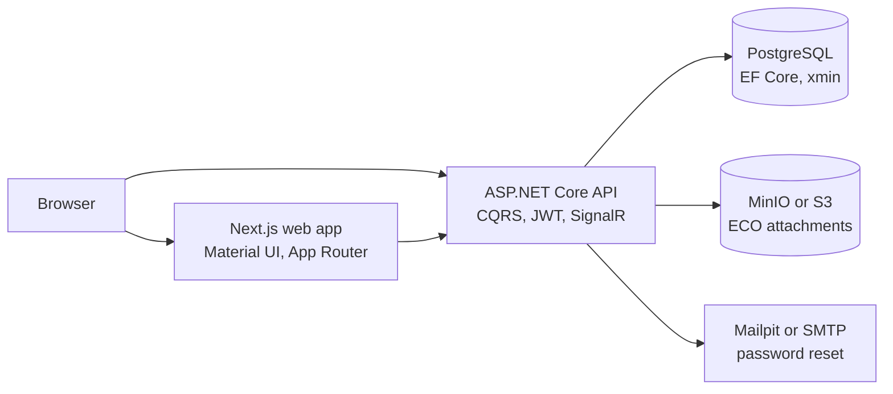
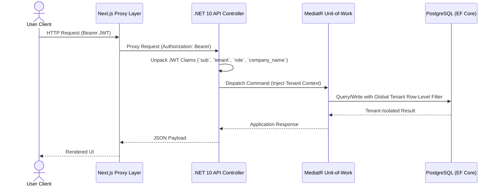
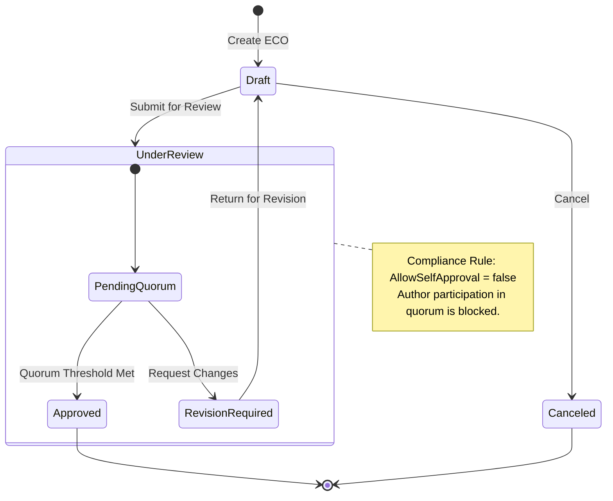

# EngiFlow

EngiFlow is a multi-tenant B2B SaaS platform for managing Engineering Change Order (ECO) workflows. It provides a governed environment for engineering, manufacturing, and quality teams to track and approve product lifecycle changes while enforcing ISO 9001-compliant segregation of duties and tenant-specific workflow policies.

### Core Features

- **Global Search:** Tenant-isolated resource navigation for locating ECOs and system resources.
- **Role-Based Dashboards:** Data-dense interfaces that adjust visibility and metrics based on user permissions.
- **Workflow Governance:** Configurable approval quorums and material action compliance enforcement.
- **Internationalization:** Multi-language support (English and Portuguese) implemented via Next.js 16 Edge proxying and cookie-based locale synchronization.

The platform is built on a Clean Architecture foundation with real-time security enforcement, automated audit trails, and strict data isolation across the full stack.

## Business Value

Engineering changes affect released designs, supplier requirements, manufacturing instructions, quality records, cost, schedule, and customer commitments. EngiFlow treats an ECO as a controlled business record instead of a generic task:

- Requesters create and revise ECO drafts.
- Authorized reviewers make formal approval decisions.
- Tenant policy determines the approval quorum.
- The author of an ECO cannot approve their own change.
- Every material workflow action creates an audit event.
- Attachments are stored in S3-compatible object storage with database metadata.
- Administrators can change roles or deactivate users, and affected sessions are updated immediately over SignalR.

The result is an enterprise-ready foundation for PLM workflows where compliance controls are enforced in the backend domain and reflected immediately in the frontend.

## Architecture

EngiFlow is a monorepo with a .NET 10 API and a Next.js 16 web application.


```mermaid
flowchart LR
    Browser["Browser"]
    Web["Next.js web app<br/>Material UI, App Router"]
    Api["ASP.NET Core API<br/>CQRS, JWT, SignalR"]
    Db[("PostgreSQL<br/>EF Core, xmin")]
    ObjectStore[("MinIO or S3<br/>ECO attachments")]
    Mail["Mailpit or SMTP<br/>password reset"]

    Browser --> Web
    Browser --> Api
    Web --> Api
    Api --> Db
    Api --> ObjectStore
    Api --> Mail
```

### Tenant Isolation & Security Flow


```mermaid
sequenceDiagram
    actor Client as User Client
    participant Frontend as Next.js Proxy Layer
    participant API as .NET 10 API Controller
    participant Pipeline as MediatR Unit-of-Work
    participant DB as PostgreSQL (EF Core)

    Client->>Frontend: HTTP Request (Bearer JWT)
    Frontend->>API: Proxy Request (Authorization: Bearer)
    API->>API: Unpack JWT Claims (`sub`, `tenant`, `role`, `company_name`)
    API->>Pipeline: Dispatch Command (Inject Tenant Context)
    Pipeline->>DB: Query/Write with Global Tenant Row-Level Filter
    DB-->>Pipeline: Tenant-Isolated Result
    Pipeline-->>API: Application Response
    API-->>Frontend: JSON Payload
    Frontend-->>Client: Rendered UI
```

Browser HTTP calls normally use the Next.js `/api/...` proxy unless a public API URL is configured. SignalR connections intentionally connect directly to the ASP.NET Core API at `/hubs/ecos` and `/hubs/security` so WebSocket traffic bypasses the Next.js proxy.

## Technology Stack

| Area | Technology |
| --- | --- |
| Frontend | Next.js 16, React 19, TypeScript, Material UI, MUI X DataGrid, MUI X Date Pickers |
| Backend | .NET 10, ASP.NET Core Web API, SignalR, JWT bearer authentication |
| Application | Internal CQRS Dispatcher-backed CQRS, FluentValidation, post-commit notifications |
| Domain | Clean Architecture, DDD aggregate roots, strongly typed IDs |
| Persistence | EF Core 10, Npgsql, PostgreSQL 18 locally, Amazon RDS PostgreSQL 17 in AWS, `xmin` optimistic concurrency |
| Storage | S3-compatible attachment storage, MinIO locally, private Amazon S3 bucket in AWS |
| Email | MailKit SMTP, Mailpit locally, Amazon SES SMTP in AWS |
| Orchestration | Docker Compose locally, AWS ECS Express Mode in production |
| Provisioning | HashiCorp Terraform modules under `infra/terraform/` |
| CI/CD | GitHub Actions OIDC pipelines under `.github/workflows/` |
| Tests | xUnit for API, application, domain, and infrastructure projects |

## Repository Layout

```text
.
+-- api/
|   +-- src/
|   |   +-- EngiFlow.Api/
|   |   +-- EngiFlow.Application/
|   |   +-- EngiFlow.Domain/
|   |   +-- EngiFlow.Infrastructure/
|   +-- tests/
|       +-- EngiFlow.Api.Tests/
|       +-- EngiFlow.Application.Tests/
|       +-- EngiFlow.Domain.Tests/
|       +-- EngiFlow.Infrastructure.Tests/
+-- web/
|   +-- app/
|   +-- components/
|   +-- lib/
+-- infra/
|   +-- terraform/
|       +-- bootstrap/
|       +-- modules/
+-- .github/
|   +-- workflows/
+-- docker-compose.yml
```

## Governance Model

### ECO State Machine


```mermaid
stateDiagram-v2
    [*] --> Draft: Create ECO
    Draft --> UnderReview: Submit for Review
    Draft --> Canceled: Cancel
    
    state UnderReview {
        [*] --> PendingQuorum
        PendingQuorum --> Approved: Quorum Threshold Met
        PendingQuorum --> RevisionRequired: Request Changes
    }
    
    Approved --> [*]
    RevisionRequired --> Draft: Return for Revision
    Canceled --> [*]
    
    note right of UnderReview
        Compliance Rule: AllowSelfApproval = false
        Author participation in quorum is blocked.
    end note
```

Important workflow rules:

- Draft ECOs can be edited, commented on, and have affected items or attachments added.
- Submitting an ECO starts a new review round.
- Only decisions from the active review round count toward quorum.
- `RequestChanges` returns the ECO to draft and requires a new review round.
- Approved and canceled ECOs are terminal for the active workflow.
- The domain aggregate creates audit events as part of state transitions.

### ISO 9001 Segregation of Duties

EngiFlow enforces a hard segregation-of-duties rule:

> Compliance Rule: The author of the ECO cannot participate in its approval quorum

The rule is enforced in the ECO decision path and in the aggregate itself, so compatibility routes and future callers cannot bypass it. This implements the core quality-system principle that the person requesting or authoring a controlled change cannot be the person approving that same change into effect.

### Tenant Workflow Policy

Tenant owners and administrators manage workflow settings through:

| Method | Route | Purpose |
| --- | --- | --- |
| `GET` | `/api/settings` | Read tenant workflow settings |
| `PUT` | `/api/settings` | Update `minApprovalsRequired` |

`MinApprovalsRequired` must be at least `1`. If an older tenant lacks a settings row, EngiFlow creates default settings on first read or update.

The frontend warns administrators when the configured quorum is higher than the count of active users whose exact role is `Approver`:

> Warning: You require X approvals, but only have Y Approvers active. ECOs may become stuck.

Owner and Administrator users can approve by authorization policy, but the warning intentionally focuses on active `Approver` role users to ensure a healthy quorum buffer.

## RBAC Matrix

| Capability | Owner | Administrator | Approver | Requester | Viewer |
| --- | --- | --- | --- | --- | --- |
| Read ECOs | Yes | Yes | Yes | Yes | Yes |
| Comment on ECOs | Yes | Yes | Yes | Yes | Yes |
| Create ECOs | Yes | Yes | No | Yes | No |
| Edit draft ECOs | Yes | Yes | No | Yes | No |
| Submit ECOs for review | Yes | Yes | No | Yes | No |
| Approve or request changes | Yes | Yes | Yes | No | No |
| Manage users | Yes | Yes | No | No | No |
| Manage workflow policy | Yes | Yes | No | No | No |

Additional immutable rules:

- `Owner` inherits Administrator privileges.
- Owner users cannot be modified or deactivated.
- No endpoint can create or promote a user to Owner.
- Users cannot change their own role.
- Users cannot deactivate themselves.
- Deactivated users cannot authenticate or act in the domain.

## Real-Time Behavior

EngiFlow uses two authenticated SignalR hubs:

| Hub | Purpose |
| --- | --- |
| `/hubs/ecos` | Tenant-scoped ECO timeline/status updates after committed commands |
| `/hubs/security` | Targeted current-user role/deactivation enforcement |

ECO events are broadcast to the tenant group. Security events are targeted to the affected SignalR user ID, which is derived from the JWT `sub` claim.

Security events:

- `UserPermissionsChanged(userId, newRole)`: the current browser session updates its stored role immediately.
- `UserDeactivated(userId)`: the current browser session clears auth storage and hard redirects to `/login`.

The API also refreshes the role from the database during JWT validation and rejects inactive users. This prevents stale JWT role claims from retaining old privileges after an administrative change.

## AWS Production Deployment

The production cloud stack is implemented as modular Terraform under `infra/terraform/`. It uses AWS ECS Express Mode for the API and web containers because AWS App Runner is no longer available to new AWS customers. Supporting managed services include Amazon ECR, Amazon RDS PostgreSQL, Amazon S3, Amazon SES SMTP, AWS Secrets Manager, CloudWatch Logs, and AWS Budgets.

### Bootstrap Protocol

Before the GitHub Actions runner can authenticate or store Terraform state, initialize the bootstrap stack once from an administrator workstation:

```bash
cd infra/terraform/bootstrap
terraform init
terraform apply \
  -var='github_owner=YOUR_GITHUB_ORG_OR_USER' \
  -var='github_repo=engiflow'
```

The bootstrap stack provisions:

- S3 remote state bucket.
- DynamoDB Terraform lock table.
- GitHub OIDC identity provider, when one is not already supplied.
- IAM deployment role trusted only by the configured GitHub repository and branch.

> [!IMPORTANT]
> Store the bootstrap outputs as GitHub repository variables: `AWS_REGION`, `AWS_ROLE_TO_ASSUME`, `TF_STATE_BUCKET`, and `TF_STATE_LOCK_TABLE`. Also configure `AWS_READONLY_ROLE_TO_ASSUME` for pull-request Terraform planning with least-privilege read-only access. Store SES SMTP credentials only as GitHub repository secrets: `SES_SMTP_USERNAME` and `SES_SMTP_PASSWORD`.

### CI/CD Blueprint

EngiFlow uses a split CI/CD model so validation and production release authority remain separate.

`.github/workflows/pr-validation.yml` is the pull-request validation pipeline. It runs only for `pull_request` events targeting `main` and should be configured as a required branch-protection check. It executes the frontend CI gate (`npm ci`, `npm run lint`, `npx tsc --noEmit`), the backend Release test gate (`dotnet test api/EngiFlow.slnx --configuration Release`), and a Terraform read-only review gate. The Terraform job authenticates through GitHub OIDC with `AWS_READONLY_ROLE_TO_ASSUME`, initializes the remote backend, runs `terraform validate`, and emits a non-mutating `terraform plan -detailed-exitcode -lock=false` delta report for the ECS Express, RDS, S3, SES, and FinOps stack.

`.github/workflows/deploy.yml` is the production deployment pipeline. It runs only after a direct `push` to `main` or a manual `workflow_dispatch`, which means normal production releases occur after a protected PR merge. Because validation already happened in `pr-validation.yml`, this workflow focuses on artifact shipping and infrastructure apply: it authenticates through GitHub OIDC with `AWS_ROLE_TO_ASSUME`, hydrates ECR if needed, builds and pushes the multi-stage API image, deploys the API service first, captures the public API Gateway URI, builds the web image with `NEXT_PUBLIC_API_BASE_URL` and `NEXT_PUBLIC_API_URL`, pushes the web image, and finishes with headless `terraform apply -auto-approve` against the ECS Express Mode stack.

> [!NOTE]
> Neither workflow requires long-lived AWS access keys. AWS trust is established by OIDC role assumption and workflow-level `id-token: write` permissions; deployment write authority is reserved for `deploy.yml`.

`.github/workflows/teardown.yml` is the Emergency FinOps Kill Switch. It is manual-only (`workflow_dispatch`) and authenticates through the deployment OIDC role before running `terraform destroy -auto-approve` in `infra/terraform/`.

> [!IMPORTANT]
> Run `teardown.yml` immediately after validation windows to destroy the production application stack and stop active ECS, RDS, S3, ECR, Secrets Manager, CloudWatch, and budgeted runtime resources. The bootstrap state bucket, lock table, and OIDC role intentionally remain so future deployments and destroys can continue to use shared remote state.

## Local Development

> [!IMPORTANT]
> **Dual-Stack Execution Standard:** Localhost via `Docker Compose` remains the official, fully operational, zero-cost first-class citizen environment for feature evaluation. The AWS production stack now lives under `infra/terraform/` and is deployed by GitHub Actions through OIDC, with no static AWS IAM access keys in repository secrets.

### Prerequisites

- Docker Desktop or Docker Engine with Compose.
- .NET SDK 10 for local backend work.
- Node.js 24 for local frontend work.

### Run the Full Stack

From the repository root:

```bash
docker compose up --build
```

Services:

| Service | URL or Port | Purpose |
| --- | --- | --- |
| `web` | `http://localhost:3000` | Next.js frontend |
| `api` | `http://localhost:8080` | ASP.NET Core API |
| Swagger | `http://localhost:8080/swagger` | API explorer in Development |
| `postgres` | `localhost:5432` | PostgreSQL database |
| `minio` | `http://localhost:9001` | S3-compatible object storage console |
| `mailpit` | `http://localhost:8025` | Local SMTP inbox |

Named volumes preserve local database and MinIO object state:

- `postgres-data`
- `minio-data`

Stop the stack:

```bash
docker compose down
```

Remove volumes too:

```bash
docker compose down -v
```

### Accessing the Application

Since the environment is empty by default, start by registering a new tenant:

```text
http://localhost:3000/register
```

Once registered, you can log in at:

```text
http://localhost:3000/login
```

## Configuration

Docker Compose supplies local defaults for PostgreSQL, MinIO, and Mailpit. Production deployments must override at least JWT signing settings and external service credentials.

JWT configuration:

```json
{
  "EngiFlow": {
    "Authentication": {
      "Jwt": {
        "Issuer": "EngiFlow.Api",
        "Audience": "EngiFlow.Clients",
        "SigningKey": "replace-with-at-least-32-characters",
        "AccessTokenMinutes": 60
      }
    }
  }
}
```

S3-compatible storage:

```json
{
  "EngiFlow": {
    "Storage": {
      "S3": {
        "BucketName": "engiflow-attachments",
        "Region": "us-east-1",
        "ServiceUrl": "http://localhost:9000",
        "AccessKey": "minioadmin",
        "SecretKey": "minioadmin",
        "ForcePathStyle": true
      }
    }
  }
}
```

Frontend API configuration:

| Variable | Purpose |
| --- | --- |
| `API_INTERNAL_BASE_URL` | Server-side Next.js proxy target, defaulting to `http://api:8080` in Docker |
| `NEXT_PUBLIC_API_URL` | Browser-visible API base URL |
| `NEXT_PUBLIC_API_BASE_URL` | Browser-visible API base URL fallback |

If no public API base URL is set, SignalR uses `http://localhost:8080` for direct browser connections.

## API Surface

| Method | Route | Purpose |
| --- | --- | --- |
| `POST` | `/api/auth/login` | Authenticate, update `LastLoginAt`, issue JWT |
| `POST` | `/api/auth/register-company` | Create tenant, first Owner, default settings, JWT |
| `POST` | `/api/auth/forgot-password` | Send password reset mail through SMTP |
| `GET` | `/api/settings` | Read tenant workflow settings |
| `PUT` | `/api/settings` | Update tenant workflow settings |
| `GET` | `/api/users` | List active tenant users with `lastLoginAt` |
| `POST` | `/api/users` | Create Administrator, Approver, Requester, or Viewer |
| `PUT` | `/api/users/{id}/role` | Change a mutable user's role |
| `PUT` | `/api/users/{id}/deactivate` | Soft-deactivate a mutable user |
| `POST` | `/api/ecos` | Create a draft ECO |
| `GET` | `/api/ecos` | List paged ECO summaries |
| `GET` | `/api/ecos/{id}` | Read an ECO with timeline details |
| `PUT` | `/api/ecos/{id}/details` | Update draft ECO details |
| `POST` | `/api/ecos/{id}/affected-items` | Add an affected item |
| `DELETE` | `/api/ecos/{id}/affected-items/{itemId}` | Remove an affected item |
| `POST` | `/api/ecos/{id}/comments` | Add a timeline comment |
| `POST` | `/api/ecos/{id}/attachments` | Upload attachment metadata and S3 object |
| `PUT` | `/api/ecos/{id}/submit` | Submit draft ECO for review |
| `POST` | `/api/ecos/{id}/review-decisions` | Submit `Approve` or `RequestChanges` |
| `PUT` | `/api/ecos/{id}/cancel` | Cancel a draft or under-review ECO |
| `PUT` | `/api/ecos/{id}/approve` | Compatibility approval route |
| `PUT` | `/api/ecos/{id}/reject` | Compatibility request-changes route |

## Verification

Backend:

```bash
dotnet test api/EngiFlow.slnx /m:1
```

Frontend:

```bash
cd web
npm run lint
npm run build
```

Useful Docker checks:

```bash
docker compose config
docker compose build
docker compose ps
```

## Production Deployment Blueprint

The following table maps the current Local Evaluation tier components to their implemented AWS Production Cloud equivalents:

| Component | Local Evaluation (Docker) | AWS Production Cloud |
| --- | --- | --- |
| **App Shell** | Next.js 16 (Node.js 24) | ECS Express Mode service sourced from ECR |
| **Web API** | ASP.NET Core (.NET 10) | ECS Express Mode service sourced from ECR |
| **Database** | PostgreSQL 18 | Amazon RDS PostgreSQL 17 on `db.t4g.micro`, Single-AZ |
| **File Storage** | MinIO (S3-Compatible) | Private Amazon S3 bucket with 1-day validation lifecycle |
| **Notifications** | Mailpit (SMTP) | Amazon SES SMTP credentials injected from Secrets Manager |
| **Container Registry** | Local Docker image cache | Amazon ECR repos retaining one image each |
| **Provisioning** | Docker Compose | HashiCorp Terraform modules under `infra/terraform/` |
| **CI/CD** | Local commands | GitHub Actions OIDC deploy and teardown workflows |
