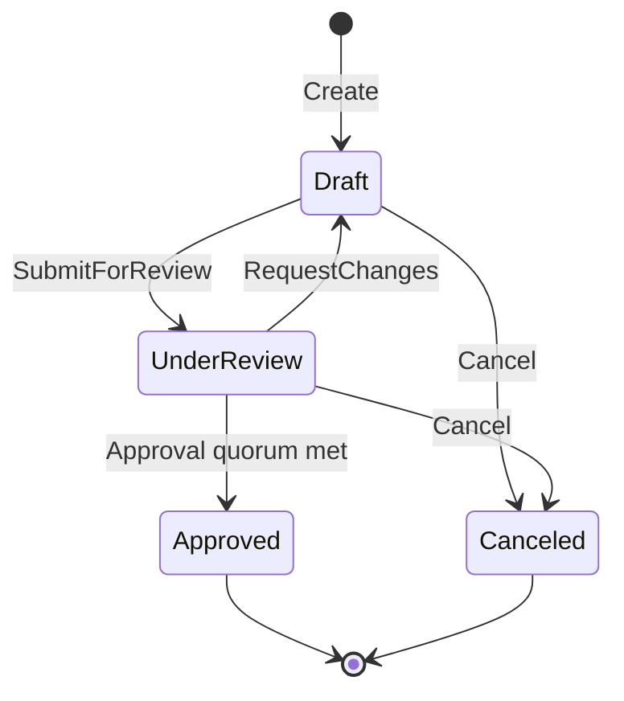

# EngiFlow API

The EngiFlow API is a .NET 10 ASP.NET Core backend for tenant-scoped Engineering Change Order governance. It follows Clean Architecture so transport, persistence, workflow policy, and domain rules stay separated.

## Project Structure

| Project | Responsibility |
| --- | --- |
| `EngiFlow.Domain` | Entities, value objects, enums, domain exceptions, guards, workflow state machine |
| `EngiFlow.Application` | CQRS use cases, DTOs, validators, persistence/security/storage abstractions |
| `EngiFlow.Infrastructure` | EF Core, PostgreSQL, migrations, repositories, S3, SMTP, transaction behavior |
| `EngiFlow.Api` | ASP.NET Core composition root, controllers, JWT, SignalR, Swagger, exception handling |

The API project is the composition root. Domain and application layers do not depend on ASP.NET Core, EF Core, or storage SDKs.

## CQRS and Internal CQRS Dispatcher

Application use cases are expressed as EngiFlow-owned CQRS contracts:

- `ICommand<TResponse>` for mutating requests.
- `IQuery<TResponse>` for read-only requests.
- `ICommandHandler<TCommand, TResponse>` and `IQueryHandler<TQuery, TResponse>` adapt to Internal CQRS Dispatcher `IRequestHandler`.
- Controllers dispatch through `IApplicationMediator` instead of depending directly on Internal CQRS Dispatcher.

Important use cases:

- `LoginQuery`: implemented as a mutating command to update `User.LastLoginAt` after successful authentication.
- `RegisterCompanyCommand`: creates company, first Owner, password hash, and default company settings.
- `CreateUserCommand`, `UpdateUserRoleCommand`, `DeactivateUserCommand`: manage tenant users with Owner/self-protection rules.
- `GetCompanySettingsQuery`, `UpdateCompanySettingsCommand`: read and update tenant quorum policy.
- ECO commands: create, edit, submit, review decision, cancel, comments, affected items, and attachments.

## Validation Pipeline

`ValidationBehavior<TRequest, TResponse>` runs FluentValidation validators before handlers execute. Validation failures throw the application `ValidationException`, which the API converts to RFC 7807 `ValidationProblemDetails` with field-level errors.

Examples:

- Email and password complexity are validated before registration or user creation.
- `MinApprovalsRequired` must be at least `1`.
- ECO titles, comments, affected-item fields, and review decisions are validated before domain operations run.

## Transaction Behavior

Infrastructure registers `TransactionBehavior<TRequest, TResponse>` as a Internal CQRS Dispatcher open pipeline behavior.

Behavior:

- Queries are not wrapped in transactions.
- Commands run inside an EF Core transaction.
- The transaction commits only after the handler completes successfully.
- On exception, the transaction rolls back.
- External compensation runs after rollback.
- Post-commit notifications publish only after the database transaction commits.

This keeps database writes ACID-compliant while avoiding false real-time broadcasts for failed commands.

## Post-Commit Notifications

Application handlers enqueue Internal CQRS Dispatcher notifications in `IPostCommitNotificationQueue`. The transaction behavior publishes them after commit.

Current notification families:

- `EcoChangedNotification`: emitted after committed ECO workflow changes and broadcast to the tenant group.
- `UserPermissionsChangedNotification`: emitted after a committed role change and targeted to the affected user.
- `UserDeactivatedNotification`: emitted after committed deactivation and targeted to the affected user.

If a post-commit notification fails, the API logs a warning but does not roll back the already committed database transaction.

## External Operation Compensation

Attachment uploads write to S3-compatible storage and then record database metadata. The application queues compensating deletes through `IExternalOperationCompensation`. If the command transaction fails after an object upload, `TransactionBehavior` calls compensation so orphaned objects are deleted.

Local development uses MinIO. Production can use Amazon S3 or another compatible provider.

## Persistence and Tenant Isolation

`EngiFlowDbContext` maps domain entities to PostgreSQL using EF Core 10 and Npgsql.

Tenant isolation controls:

- Tenant-scoped entities implement `ITenantScoped`.
- Global query filters constrain tenant reads by the authenticated tenant claim.
- Users have an additional active-user query filter.
- Save-time validation rejects writes where an `ITenantScoped` entity does not match the current tenant.
- New-tenant bootstrap graphs are explicitly allowed when creating a company and its first Owner.

Strongly typed IDs are persisted as `uuid` columns through EF value converters.

## Optimistic Concurrency

`EngineeringChangeOrder.RowVersion` is mapped to PostgreSQL `xmin`. EF Core treats it as an optimistic concurrency token.

When two requests edit the same ECO concurrently:

- The first committed write succeeds.
- The later stale write raises `DbUpdateConcurrencyException`.
- The global exception handler returns `409 Conflict` with guidance to refresh and retry.

This protects PR-like ECO edits and review decisions from overwriting one another.

## ECO State Machine

The `EngineeringChangeOrder` aggregate owns the workflow:



Domain invariants:

- Draft ECOs can be edited.
- Review decisions can be submitted only while under review.
- Approvals count only in the active review round.
- `RequestChanges` returns the ECO to draft.
- Approved and canceled ECOs are terminal in the MVP.
- The ECO author cannot participate in the approval quorum.
- Every material business action appends an `EcoEvent`.

The domain-level segregation-of-duties message is:

```text
Compliance Rule: The author of the ECO cannot participate in its approval quorum
```

## Company Settings

Company settings are stored in the `company_settings` table:

- `company_id`: tenant primary key and foreign key.
- `min_approvals_required`: approval quorum, constrained to `>= 1`.
- `created_at`, `updated_at`: UTC lifecycle timestamps.

HTTP endpoints:

| Method | Route | Authorization |
| --- | --- | --- |
| `GET` | `/api/settings` | `Owner` or `Administrator` |
| `PUT` | `/api/settings` | `Owner` or `Administrator` |

The handlers create default settings when missing so older tenants can self-heal on first access.

## User Governance

User model fields include:

- `Id`
- `CompanyId`
- `Email`
- `DisplayName`
- `Role`
- `PasswordHash`
- `IsActive`
- `CreatedAt`
- `LastLoginAt`
- `DeactivatedAt`

Rules:

- Owner users cannot be modified or deactivated.
- Users cannot promote anyone to Owner.
- Users cannot change their own role.
- Users cannot deactivate themselves.
- Deactivation is a soft delete.
- Active users are returned by `GET /api/users`; inactive users are hidden by the EF Core query filter.
- Login updates `LastLoginAt` only after credentials, active-user status, and active-company status pass validation.

Canonical HTTP routes:

| Method | Route | Purpose |
| --- | --- | --- |
| `GET` | `/api/users` | List active users with `lastLoginAt` |
| `POST` | `/api/users` | Create Administrator, Approver, Requester, or Viewer |
| `PUT` | `/api/users/{id}/role` | Change role |
| `PUT` | `/api/users/{id}/deactivate` | Soft deactivate |

## Authentication and Authorization

The API uses ASP.NET Core JWT bearer authentication.

JWT claims:

| Claim | Purpose |
| --- | --- |
| `sub` | User ID |
| `tenant` | Company tenant ID |
| `role` | Role name |
| `user_name` | Display name |
| `company_name` | Tenant display name |

The API sets `MapInboundClaims = false` and uses EngiFlow claim names directly. SignalR accepts access tokens from the `access_token` query parameter only for `/hubs/...` requests.

On every token validation, the API reloads the user by `sub` through a query-filter-bypassing authentication repository method. It rejects inactive users and replaces the role claim with the current database role. This is the backend control that prevents stale tokens from retaining old permissions.

Authorization policies:

| Policy | Roles |
| --- | --- |
| `EcoAuthoring` | Owner, Administrator, Requester |
| `EcoApproval` | Owner, Administrator, Approver |
| `UserManagement` | Owner, Administrator |

Settings endpoints use `[Authorize(Roles = "Owner,Administrator")]`.

## SignalR

Hubs:

| Hub | Contract | Use |
| --- | --- | --- |
| `/hubs/ecos` | `IEcoClient` | Tenant ECO updates |
| `/hubs/security` | `ISecurityClient` | Targeted permission/deactivation updates |

`EcoHub` adds each connection to a tenant group derived from the JWT `tenant` claim. `SecurityHub` uses `SubjectUserIdProvider`, which maps SignalR `User(...)` targeting to the JWT `sub` claim.

Security client methods:

```csharp
Task UserPermissionsChanged(Guid userId, string newRole);
Task UserDeactivated(Guid userId);
```

## Error Handling

`GlobalExceptionHandler` converts exceptions to RFC 7807 responses.

| Failure | Status |
| --- | --- |
| Authentication failure | `401 Unauthorized` |
| Authorization failure or missing authenticated context | `401 Unauthorized` or framework `403 Forbidden` |
| Validation failure | `400 Bad Request` |
| Entity not found | `404 Not Found` |
| Domain business rule violation | `409 Conflict` |
| EF concurrency conflict | `409 Conflict` |
| Unexpected exception | `500 Internal Server Error` |

Domain exceptions intentionally do not reference ASP.NET Core so the domain remains transport-independent.

## Migrations

List migrations:

```bash
dotnet tool restore
dotnet tool run dotnet-ef -- migrations list \
  --project api/src/EngiFlow.Infrastructure/EngiFlow.Infrastructure.csproj \
  --startup-project api/src/EngiFlow.Api/EngiFlow.Api.csproj \
  --context EngiFlowDbContext
```

Add a migration:

```bash
dotnet tool run dotnet-ef -- migrations add MigrationName \
  --project api/src/EngiFlow.Infrastructure/EngiFlow.Infrastructure.csproj \
  --startup-project api/src/EngiFlow.Api/EngiFlow.Api.csproj \
  --context EngiFlowDbContext \
  --output-dir Persistence/Migrations
```

The current governance migration adds `users.last_login_at`.

## Local Run

From the repository root:

```bash
docker compose up --build
```

Direct API run:

```bash
dotnet run --project api/src/EngiFlow.Api/EngiFlow.Api.csproj
```

Swagger in development:

```text
http://localhost:8080/swagger
```

## Tests

Run all backend tests:

```bash
dotnet test api/EngiFlow.slnx /m:1
```

Coverage areas:

- Domain user invariants and last-login recording.
- ECO state machine and segregation-of-duties rule.
- CQRS validation behavior.
- Authentication and tenant claim resolution.
- Settings query/update handlers.
- User management rules and security notifications.
- API controller route dispatch.
- EF Core tenant filters, write validation, audit interception, and model metadata.
