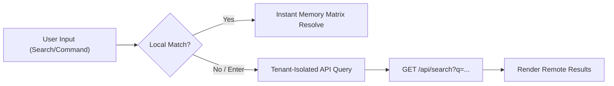

# EngiFlow Web

The EngiFlow web app is a Next.js 16 App Router frontend for governed Engineering Change Order workflows. It uses React 19, TypeScript, Material UI, MUI X DataGrid, direct SignalR connections, and a small typed API client.

## App Router Structure

Key routes:

| Route | Purpose |
| --- | --- |
| `/login` | Public sign-in with remember-me session storage |
| `/register` | Public tenant registration wizard |
| `/` | Authenticated dashboard |
| `/ecos` | ECO list with MUI X DataGrid filters and pagination |
| `/ecos/new` | Draft ECO creation |
| `/ecos/[id]` | PR-like ECO review experience |
| `/settings/users` | Team Management DataGrid |
| `/settings/workflow-policies` | Approval quorum policy |

Authenticated routes live under `app/(authenticated)` and are wrapped by:

- `ProtectedRoute`: redirects anonymous users to `/login`.
- `AppShell`: fixed top bar, responsive drawer navigation, role-aware actions, and the global security SignalR listener.
- `settings/layout.tsx`: nested settings layout with Team Management and Workflow Policies side tabs.

## Material UI

The app uses Material UI with:

- `@mui/material-nextjs` App Router cache provider.
- Roboto font via `@fontsource/roboto`.
- A restrained B2B SaaS theme in `lib/theme.ts`.
- MUI X DataGrid for ECO dashboards and Team Management.
- MUI icons for actions, navigation, row menus, and workflow controls.

The UI avoids marketing-style composition inside authenticated workflows. Settings and ECO pages are built as dense operational tools with responsive spacing, stable grid dimensions, and predictable controls.

## API Client and Proxy

`lib/api/client.ts` wraps native `fetch`.

Behavior:

- Adds `Authorization: Bearer <token>` from auth storage.
- Serializes JSON request bodies.
- Parses JSON and text responses.
- Converts failed responses into `ApiError`.
- On `401`, clears auth state and redirects to `/login`.

HTTP requests use same-origin `/api/...` by default. `app/api/[...path]/route.ts` proxies these requests to the backend using:

```text
API_INTERNAL_BASE_URL=http://api:8080
```

For local non-Docker development, the proxy falls back to `http://localhost:8080`.

## Direct SignalR Strategy

SignalR browser connections connect directly to the ASP.NET Core API, not through the Next.js proxy.

Base URL resolution:

```text
NEXT_PUBLIC_API_URL
NEXT_PUBLIC_API_BASE_URL
http://localhost:8080
```

Hubs:

| Hook | Hub | Purpose |
| --- | --- | --- |
| `useEcoHub` | `/hubs/ecos` | Tenant-scoped ECO updates |
| `useSecurityHub` | `/hubs/security` | Current-user role and deactivation enforcement |

Both hooks pass the JWT through SignalR's `accessTokenFactory`. The backend accepts that token through the SignalR `access_token` query string path for `/hubs/...`.

## Authentication State

`AuthContext` derives the current user from the stored JWT and stored session metadata.

Session storage rules:

- Remembered sessions use `localStorage`.
- Non-remembered sessions use `sessionStorage`.
- The bearer token is mirrored to a non-HttpOnly cookie for the Next.js API proxy.
- An auth-state browser event keeps open components synchronized.

JWT claims consumed by the frontend:

| Claim | Purpose |
| --- | --- |
| `sub` | Current user ID |
| `tenant` | Company tenant ID |
| `role` | Primary role |
| `user_name` | Display name |
| `company_name` | Tenant display name |
| `exp` | Expiration |

The `roles` array stored in the session can override the token role for immediate UI updates after a SignalR role-change event. The backend still refreshes roles during JWT validation, so the server remains authoritative.

## Real-Time Security Enforcement

`components/security/useSecurityHub.ts` is mounted by `AppShell` for every authenticated route.

Events:

- `UserPermissionsChanged(userId, newRole)`: if `userId` matches the current user, the stored auth session role is replaced immediately. Navigation, buttons, and page authorization checks update without a full reload.
- `UserDeactivated(userId)`: if `userId` matches the current user, the browser clears stored auth state, alerts the user, and performs a hard redirect to `/login`.

This is a UX layer over the backend control. The API also rejects inactive users and refreshes database roles during token validation.

## Team Management

`/settings/users` uses MUI X DataGrid.

Columns:

- Name with avatar initials.
- Email.
- Role dropdown showing all five roles: `Owner`, `Administrator`, `Approver`, `Requester`, `Viewer`.
- Last Active, backed by `lastLoginAt`, formatted as date/time or `Never`.
- Row actions menu with deactivation.

Safety behavior:

- Current user's row disables role changes and row actions with tooltip: `You cannot modify your own account.`
- Owner rows disable role changes and row actions.
- Role changes use `PUT /api/users/{id}/role`.
- Deactivation uses `PUT /api/users/{id}/deactivate`.
- Deactivating an Administrator shows a severe confirmation dialog.
- Deactivated users are removed from the active grid after success.

The invite dialog can create Administrator, Approver, Requester, or Viewer users. Owner creation and promotion are intentionally unavailable.

## Workflow Policies

`/settings/workflow-policies` reads and updates tenant quorum policy through:

```text
GET /api/settings
PUT /api/settings
```

The form updates `minApprovalsRequired`. It also loads active users and warns when quorum exceeds active users whose exact role is `Approver`:

```text
Warning: You require X approvals, but only have Y Approvers active. ECOs may become stuck.
```

Owner and Administrator users can approve ECOs by RBAC policy, but this warning intentionally focuses on active `Approver` role users to ensure a healthy quorum buffer.

## ECO Dashboard

`/ecos` uses MUI X DataGrid with:

- Server pagination.
- Global search.
- Status and priority filters.
- Created-date range filters.
- User-context filters such as created-by-me and awaiting-my-review.
- Requester avatars.
- Reviewer progress.
- Linked detail navigation.
- Empty and loading states.

## ECO Detail Experience

`/ecos/[id]` provides the PR-like review surface:

- Sticky workflow actions.
- State and quorum summary.
- Conversation, Affected Items, and Files tabs.
- Comment timeline.
- Review decision submission.
- Local comment draft autosave.
- Attachment drawers and download links.
- Real-time updates through `useEcoHub`.

The page listens for ECO SignalR updates and refreshes visible workflow/timeline state when the current tenant receives committed ECO changes.

## RichTextRenderer

`components/ecos/RichTextRenderer.tsx` renders controlled rich text for comments.

Supported:

- GitHub-flavored Markdown through `remark-gfm`.
- Math blocks and inline math through `remark-math` and `rehype-katex`.
- Mermaid fenced code blocks.
- Safe links for `http`, `https`, `mailto`, root-relative, and hash links.

Security and cleanup:

- Raw HTML is skipped with `skipHtml`.
- Mermaid uses `securityLevel: "strict"` and `htmlLabels: false`.
- Mermaid is initialized once per runtime.
- Each diagram uses a React-generated unique ID.
- Rendering effects use a cancellation flag.
- On unmount, the rendered container calls `replaceChildren()` to remove Mermaid DOM output and prevent stale SVG nodes from leaking across route changes.

## Advanced Frontend Modules

The frontend utilizes high-tier patterns to deliver a dense, operational cockpit experience:

- **Command Palette Modal:** A hybrid orchestration tool that provides instant navigation. It handles client-side static route filtering for speed and performs "Enter-to-Search" database fetching for tenant-scoped resources.



- **Role-Based Adaptive Dashboard:** Implemented in `app/(authenticated)/page.tsx`, this GitLab-inspired cockpit dynamically omits irrelevant metric widgets and UI nodes from the DOM (e.g., using `isViewer` checks) rather than printing empty zero fields.
- **Workflow Policies UI:** A two-column symmetric governance page (`/settings/workflow-policies`) featuring reactive input validation and real-time compliance warnings.
- **Internationalization (I18n) Framework:** An isomorphic context engine consuming pure JSON dictionaries (`en.json`, `pt-BR.json`). It is powered by a Next.js 16 Edge Proxy (`web/proxy.ts`) that manages locale detection via the `engi-locale` cookie and `Accept-Language` header fallback.

```mermaid
graph TD
    A["Incoming Route Request"] --> B["Next.js Edge Proxy (proxy.ts)"]
    B --> C{Check "engi-locale" Cookie}
    C -- Absent --> D["Parse Accept-Language Header"]
    C -- Present --> E["Verified Language Token"]
    D --> E
    E --> F["Bind Token to Response Cookie"]
    F --> G["Hydrate Client I18nProvider"]
    G --> H["JSON Lexicon (en.json / pt-BR.json)"]
    H --> I["Render Translated React Nodes"]
```

## Local Storage Autosave

ECO comment drafts autosave to local storage with an ECO-specific key:

```text
eco-{id}-draft
```

Drafts are cleared only after successful comment submission. This prevents accidental data loss during refreshes, route changes, or transient network failures.

## Local Development

Install dependencies:

```bash
npm install
```

Run locally:

```bash
npm run dev
```

Verify:

```bash
npm run lint
npm run build
```

Environment example:

```text
NEXT_PUBLIC_API_BASE_URL=http://localhost:8080
```

When running the full Docker Compose stack, the web container uses:

```text
API_INTERNAL_BASE_URL=http://api:8080
```

and the browser reaches the API through mapped host port `8080` for direct SignalR connections.

## Production Notes

> [!TIP]
> **Edge Delivery & Localization:** In production, assets and localized cookies are handled via **Amazon CloudFront**. This ensures that the `engi-locale` preference is respected at the edge, while specific cache invalidation strategies maintain UI consistency across deployments.

- Keep `NEXT_PUBLIC_API_URL` or `NEXT_PUBLIC_API_BASE_URL` aligned with the externally reachable API origin so SignalR can connect directly.
- Use HTTPS in production so bearer tokens are not exposed over cleartext transport.
- The auth cookie is intentionally not HttpOnly because it supports the isomorphic proxy pattern. A production hardening pass should evaluate a backend-for-frontend session strategy or refresh-token flow.
- UI authorization is convenience only. The API remains authoritative for RBAC, tenant isolation, inactivity, and segregation-of-duties enforcement.
